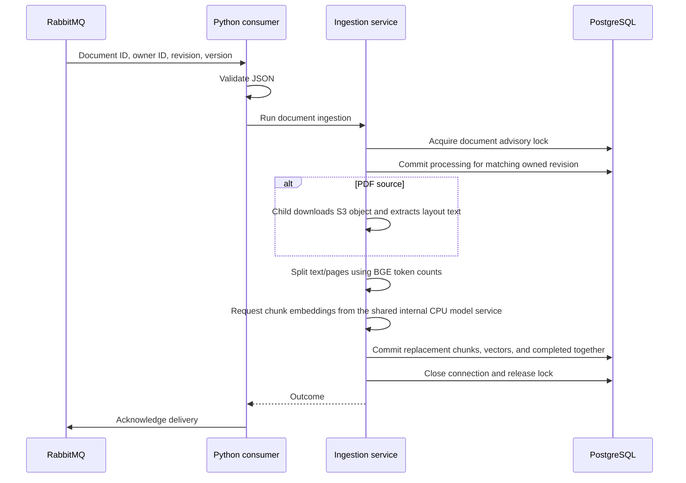
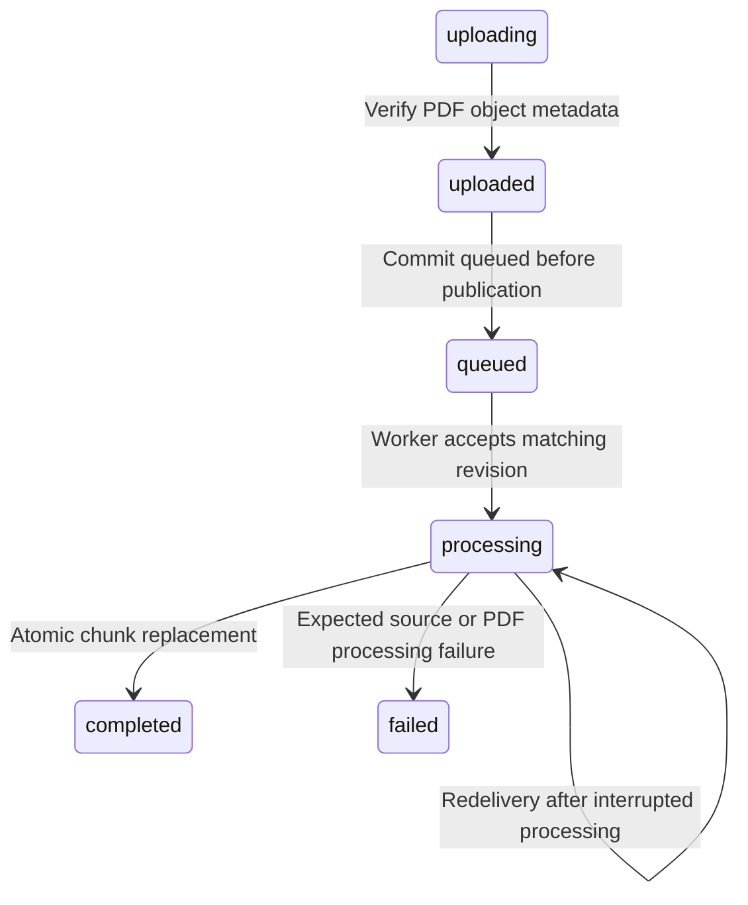

# RAGnarok Architecture

## Document status

- Status: Accepted for V1 implementation
- Last updated: 2026-09-21
- Related product definition: `docs/product-requirements.md`

## Architectural summary

RAGnarok V1 has a TypeScript web application and a Python ingestion worker in one repository:

1. A Next.js web process that renders the UI and owns the browser-facing HTTP boundary.
2. A Python RabbitMQ worker process that performs asynchronous document ingestion.
3. One internal Python HTTP embedding process that loads the model once and serves both the worker and Next.js.

The web application owns TypeScript services under `src/server`. The worker owns Python ingestion services under `worker/src/ragnarok_ingestion`. They share a versioned JSON message contract and the PostgreSQL schema, not executable modules. Drizzle remains the sole migration owner; Python repositories query that schema without a second migration system. PostgreSQL is the durable system of record. RabbitMQ coordinates background jobs. Original PDFs live in S3-compatible object storage.

Next.js remains the browser-facing backend. A narrow internal Python embedding API is now justified by sharing one resident local model between synchronous queries and asynchronous ingestion. It owns inference only, with no database access or browser authentication. A broader Fastify, NestJS, or Python application API remains unnecessary.

## V1 stack

This table includes planned retrieval, deployment, and CI components. See the
[roadmap](roadmap.md) for implementation status.

| Concern | Choice | Purpose |
| --- | --- | --- |
| Web framework | Next.js App Router | UI rendering, routing, server-side data access, and browser-facing HTTP endpoints |
| UI | React | Interactive application interface |
| Languages | Strict TypeScript for web; typed Python 3.14 for ingestion | Web development plus Python document-processing experience |
| Runtimes | Node.js 24 LTS and Python 3.14 | Separate web and ingestion processes |
| Package management | npm for web; uv for worker | uv manages Python, the worker environment, and uv.lock; initial lock generated and inspected |
| Text splitting | langchain-text-splitters | Local recursive character splitting; no model API required |
| Styling | Tailwind CSS with semantic CSS variables | Fast dashboard implementation with a controlled token boundary |
| Database | PostgreSQL | Durable application, document, conversation, and trace state |
| ORM and migrations | Drizzle ORM | Typed queries and committed schema migrations |
| Vector search | pgvector | Semantic retrieval inside PostgreSQL |
| Lexical search | PostgreSQL full-text search | Hybrid retrieval without another search service |
| Message broker | RabbitMQ | Deliver ingestion messages to workers; services own document state and retry policy |
| Object storage | S3-compatible storage | Original uploaded PDF bytes |
| Unit/integration tests | Vitest for TypeScript; pytest for Python; existing unittest cases retained during adoption | Test each runtime independently |
| Integration infrastructure | Testcontainers | Disposable PostgreSQL/pgvector instances with migrations applied from scratch |
| End-to-end tests | Playwright | Critical browser flows once the first complete flow exists |
| Local infrastructure | Docker Compose | Reproducible PostgreSQL, RabbitMQ, and object storage |
| Production runtime | Docker Compose and Nginx | Single-VPS process isolation, HTTPS, and web-instance load balancing |
| CI/CD | GitHub Actions | Lint, type checking, tests, build, and later deployment |

Authentication uses Better Auth. PDF extraction uses pypdf in layout mode. Ingestion uses local BGE-small English embeddings through FastEmbed/ONNX Runtime. Generation calls OpenRouter through a server-only adapter with a configurable model. The production object-storage provider remains an implementation decision.

## Repository structure

Directories are created only when the first real file for that responsibility exists.

```text
ragnarok/
├── src/
│   ├── app/                       # Next.js route and rendering boundary
│   │   ├── (public)/
│   │   ├── (authenticated)/
│   │   │   ├── documents/
│   │   │   ├── chat/
│   │   │   └── traces/
│   │   └── api/
│   ├── features/                  # Product-facing React components
│   │   ├── documents/
│   │   ├── chat/
│   │   └── traces/
│   ├── server/                    # Trusted Node.js modules
│   │   ├── auth/
│   │   ├── db/
│   │   │   ├── client.ts
│   │   │   └── schema/           # Drizzle tables grouped by capability
│   │   ├── modules/               # Business capabilities
│   │   │   ├── documents/
│   │   │   ├── ingestion/
│   │   │   └── rag/
│   │   ├── queue/
│   │   ├── storage/
│   │   └── observability/
│   └── shared/                    # Environment-neutral TypeScript contracts
├── worker/
│   ├── pyproject.toml             # Python dependencies
│   ├── src/ragnarok_ingestion/    # Python ingestion, repositories, and consumer
│   └── tests/unit/                # Python unit tests; integration tests live alongside them
├── drizzle/                       # Committed SQL migrations
├── tests/
│   ├── integration/
│   └── fixtures/
├── e2e/
├── docs/
│   ├── product-requirements.md
│   ├── architecture.md
│   └── decisions/                 # Added only for decisions needing their own history
├── infra/
│   └── nginx/
├── public/
├── .github/
│   └── workflows/
├── compose.dev.yml
├── compose.prod.yml
├── Dockerfile
├── drizzle.config.ts
├── package-lock.json
└── package.json
```

## Module responsibilities

### `src/app`

Owns Next.js-specific concerns:

- URL structure and layouts
- Server and Client Component composition
- Route handlers
- Server Actions when they materially simplify a form workflow
- HTTP request parsing and response mapping

Pages and route handlers remain thin. They authenticate, parse input, call an application service, and translate its result or typed error into UI or HTTP output.

### `src/features`

Owns product-facing React components grouped by user capability. Client Components are introduced only around interactive UI. Tailwind classes live with these components and consume semantic CSS variables where appropriate.

### `src/server`

Owns trusted Node.js behavior:

- Application workflows and business rules
- Repositories and database queries
- Authentication and authorization
- Queue and object-storage clients
- Retrieval, context construction, generation, and citation validation
- Structured trace and logging behavior

The directory name is a human convention, not a bundler rule. Next-specific modules that must never enter a Client Component graph use `import "server-only"`. The Python worker does not import TypeScript modules. Framework-independent TypeScript modules can omit that marker when needed by tests; `server-only` relies on the React server export condition supplied by the Next.js compiler. Directory import rules and dependency checks protect the complete `src/server` boundary.

`src/server/modules` groups business capabilities such as documents, ingestion, and RAG. Infrastructure integrations such as the database client, queue, and object storage remain outside that directory. A module may use several infrastructure adapters, and a database table does not automatically require its own module or service.

### `src/shared`

Contains code that is safe in both browser and server dependency graphs:

- Request and response schemas
- Public DTO interfaces
- Environment-neutral constants
- Pure validation or formatting functions

It does not import database clients, Node-only APIs, secrets, RabbitMQ, or provider clients.

### `worker/src/ragnarok_ingestion`

Contains Python ingestion behavior. The entry point configures logging, loads the matching tokenizer and HTTP embedding adapter, and starts the RabbitMQ consumer. The consumer validates messages and delegates to the ingestion service, which owns repository calls and transactions. PDF download and extraction run in one bounded child process. The parent chunks page text using the model tokenizer and requests embeddings from the shared service before persistence.

## Client and server dependency graphs

The `server` folder belongs to the trusted Next.js server build. It is excluded only from browser JavaScript.

```text
Server Component / route handler -> server -> shared
Python worker entry point        -> Python ingestion service -> Python repositories
Client Component                 -> features/shared UI -> shared
Client Component                 -X-> server
```

Enforcement:

1. Next-only server modules import `server-only`.
2. Client Components use `"use client"` only at the smallest interactive boundary.
3. Client modules never import from `@/server`.
4. Shared modules never re-export server modules.
5. ESLint import restrictions reinforce the dependency rule.
6. A dependency check verifies that client entry points cannot reach `src/server`.
7. CI contains a Next.js build check; a deliberate `server-only` boundary test is performed during setup.
8. Secrets use server-only environment variables and are never passed to Client Components.

`"use server"` is reserved for Server Functions. It is not used as a general replacement for `server-only`.

## DTO boundary

A Data Transfer Object is the intentionally limited data shape allowed to cross a process, transport, or trust boundary. DTOs are not database rows and do not contain behavior.

Example boundaries in RAGnarok:

- Server Component to Client Component props
- HTTP request and response bodies
- Queue job payloads
- Safe public trace data

```ts
interface DocumentRow {
  id: string;
  userId: string;
  storageKey: string | null;
  sourceText: string | null;
  processingError: string | null;
  createdAt: Date;
}

interface DocumentSummaryDto {
  id: string;
  title: string;
  status: "uploading" | "uploaded" | "queued" | "processing" | "completed" | "failed";
  createdAt: string;
}
```

The service maps `DocumentRow` to `DocumentSummaryDto`. This prevents storage keys, full source text, internal errors, and non-serializable `Date` objects from crossing into browser data accidentally.

DTOs are created when a real boundary exists. Internal functions do not receive duplicate DTO shapes merely to satisfy a layering pattern.

## Barrel-file policy

A barrel file is an `index.ts` file that re-exports items from other files:

```ts
export { DocumentList } from "./DocumentList";
```

Small barrels are allowed for a component's intentional public API. Mixed barrels are forbidden. A mixed barrel exposes client-safe and server-only modules from the same entry point, making dependency direction unclear and risking accidental client imports.

```ts
// Forbidden
export { DocumentList } from "./DocumentList";
export { deleteDocument } from "@/server/modules/documents/delete-document";
```

Server and client entry points remain separate. Cross-layer imports prefer explicit module paths when that makes the runtime boundary clearer.

## Application and persistence boundaries

Repositories own persistence operations:

```text
get document row
list owned documents
insert chunks
replace chunks
update document status
```

Application services own user-visible workflows:

```text
create PDF document
edit text document
retry document ingestion
answer a question
delete a document and its stored object
```

Services own transactions that span multiple repositories or workflow steps. Repositories do not encode user intent, and route handlers do not contain business workflows.

PDF uploads use a two-phase object-storage workflow. The server authenticates the user, validates metadata, generates the object key, persists an `uploading` document, and returns a five-minute presigned PUT URL. The browser sends bytes directly to object storage. A completion action performs an ownership-filtered lookup, verifies content type and byte length through object metadata, and atomically transitions the document to `uploaded`. The signed PUT uses `If-None-Match: *` so the same authorization cannot overwrite a verified object.

## Phase 4 decisions and implementation order

RabbitMQ replaces the earlier BullMQ/Redis plan. It connects the TypeScript publisher and the Python worker through established messaging clients. Learning message delivery and acknowledgements is an explicit project goal. The trade-off is more application work for retry delays, attempt limits, and failure handling than BullMQ supplies through job options.

RabbitMQ does not use Redis. Redis is disabled by default behind the `legacy-redis` Compose profile, and the web environment no longer requires `REDIS_URL`. Its volume is retained. An existing Redis container must be stopped explicitly; changing profiles does not stop a running container. RabbitMQ is configured in `compose.dev.yml`. Next.js publishes text submissions and verified PDF upload completions to the Python consumer.

Start with one ingestion queue and one Python worker process. The worker delegates to an ingestion service and initially processes one document at a time. A single message covers loading, extraction, chunking, and persistence. Retries may repeat computation; duplicate persisted chunks remain forbidden. PostgreSQL stores document status and chunks. RabbitMQ carries a versioned message containing `version`, `documentId`, `revision`, and `userId`; it does not carry source contents or storage credentials. The producer supplies the authenticated owner, and the service checks ownership and revision in its database query before reading a source.

A consumer acknowledges delivery only after the service has committed its outcome. Delivery can repeat, so chunk replacement and document completion must commit together and reject stale revisions. Saving a document and publishing a message are separate operations; durable scheduling intent and recovery must close that failure gap before public deployment. RabbitMQ acknowledgements do not establish business completion in PostgreSQL.

Implement in small steps:

1. Inspect sample text and define chunk output, size measurement, and overlap behavior. Implement and unit-test a deterministic chunking function without a queue or database.
2. Define the chunk schema, generate its migration, and test persistence against an empty Testcontainers database.
3. Implement source loading, PDF extraction, and the ingestion service with focused service tests.
4. Add RabbitMQ configuration and implement publication, a thin consumer, bounded retries, and recovery. Test actual broker delivery and worker crashes with Testcontainers.

Start with paragraph-aware splitting and a maximum size. Chunks can have different sizes. The initial Python chunker uses 1,000 Unicode code points and a target overlap of 150, both adjustable. Sample chunks have been reviewed; these remain trial values pending retrieval evaluation. Chunks carry ordinal, text, and optional PDF page number; persistence records the source revision and chunk configuration. Store one active chunk set per document, including source revision, order, text, source location where available, and enough method/version/settings metadata to identify how it was produced. Later customization can change settings or replace the method; simultaneous chunk sets are deferred.

The Python chunker uses the pinned `langchain-text-splitters` package and its `RecursiveCharacterTextSplitter`. This local operation needs no provider credentials. Ordinary functions remain suitable for this fixed ingestion workflow. LangGraph and agents are outside V1. After ordinary RAG works, a separate learning exercise can introduce tool calling, then conditional workflows and persisted execution. Python is an explicit learning choice for this milestone. It adds dependency management, message-contract validation in both languages, and separate persistence code. It does not add a Python HTTP API. See `worker/README.md` for setup and current limitations.

## Chunk persistence

The Phase 4 schema definitions are `src/server/db/schema/document-chunks.ts` and `src/server/db/schema/chunk-configs.ts`.
Migration `0004_high_sentry.sql` was generated and verified against fresh Testcontainers PostgreSQL; all 18 schema tests pass.

Each `document_chunk` row stores:

- `id`: UUID for referring to the passage later.
- `document_id`: parent document, with cascade deletion. Ownership is checked by joining the document and filtering its `user_id`; it is not duplicated on chunks.
- `revision`: the source revision that produced the chunk. It deliberately does not reference the document's mutable current revision, so old chunks survive edits until replacement commits.
- `ordinal`: zero-based position across the document, not restarted on each PDF page.
- `text`: nonblank chunk content.
- `page_number`: nullable for submitted text; a positive one-based PDF page when available. PDF extraction splits each page separately so a chunk belongs to one page. This simplifies citations but can split context across page boundaries.
- `chunk_config_id`: required reference to the configuration that produced this chunk.
- `created_at`: insertion timestamp.

The unique index on `(document_id, revision, ordinal)` prevents duplicate positions and supports document/revision lookups. Settings live in `chunk_config`, with a UUID, `chunking_method`, `chunk_size`, `chunk_overlap`, and creation timestamp. A unique index on method, size, and overlap allows reuse across documents. The method identifies the size unit: legacy configurations count Unicode code points; BGE configurations count model tokens. Referenced configurations cannot be deleted. Configurations must be treated as immutable by application services: new settings or method versions get a different row. The schema does not prevent direct SQL updates to a configuration.

The ingestion service must check text length against the selected configuration and use one configuration within a replacement set, check the current revision, and replace chunks plus completion status atomically. A PostgreSQL CHECK cannot read the referenced configuration, so text length is no longer checked against size on the chunk row. Constraints alone do not enforce those workflow rules. The schema allows multiple revisions to coexist; the replacement workflow determines which set remains active.

The original Phase 4 schema contained no embeddings. Phase 5 migration
`0005_groovy_swordsman.sql` adds `embedding vector(384)`, `embedding_model`, and
`embedding_revision`. A check constraint requires either all three fields or none,
preserving legacy rows without inventing vectors. New ingestion always writes all
three. Existing documents are not automatically requeued. Future retrieval must
filter out null vectors and require compatible model/revision metadata as well as
ownership and completed status. Drizzle owns migrations; Python writes through
Psycopg using parameterized vector casts. That schema step added no vector index or lexical fields. Semantic retrieval is now implemented as described in [retrieval.md](retrieval.md); exact search uses the existing relational indexes.

## Local embedding ingestion

The application provisions Qdrant's quantized ONNX artifact for `BAAI/bge-small-en-v1.5`
at revision `52398278842ec682c6f32300af41344b1c0b0bb2`. The loader reads a local
folder and never downloads at runtime. `EMBEDDING_MODEL_DIR` optionally overrides
`worker/models/bge-small-en-v1.5`; it must contain this exact artifact. File hashes
are not checked at load time. The model is English-only, produces 384-dimensional
normalized vectors, and runs with two inference threads and batches of eight.

Production chunking now uses 384 content tokens with 48 target overlap, identified
by `recursive-bge-small-en-v1.5-token-v1`. Older `recursive-character-v1` settings
remain character counts. The tokenizer checks complete inputs against 512 tokens;
oversized input is rejected rather than silently truncated. PDF pages are chunked
separately to preserve citation page numbers. The character-based chunking example
remains available, but production ingestion uses the token-aware wrapper.

Parsing, chunking, embedding, and persistence remain separate functions within one
job. No intermediate checkpoints are persisted. Computation happens outside the
final transaction; the existing owned-revision update, chunk/vector replacement,
and completion commit atomically. A concurrent edit discards stale results. Safe
embedding-input rejections mark the matching revision failed; unexpected model
errors retain the existing unacknowledged-message behavior. Old chunks and vectors
survive failed preparation or a rolled-back replacement. Existing retry/shutdown
limitations still apply. TypeScript query embedding now calls the shared Python service through a validated HTTP adapter.

## Python worker integration

The Python package contains text chunking, PostgreSQL repositories, a text/PDF ingestion service, Pydantic message validation, and an aio-pika consumer. The TypeScript document service now calls `publishIngestionJob` after saving a text document and committing its queued state. Verified PDF upload completion now queues and publishes the owned revision too.

Next.js authenticates the user and saves the source through its existing TypeScript services and Drizzle repositories. It publishes a versioned JSON message through RabbitMQ. A separately running Python consumer validates that message and delegates to the Python ingestion service. The service queries PostgreSQL with owner, document, and revision filters before accessing the source, then calls extraction and chunking. The web application continues to read status from PostgreSQL through Drizzle; no callback to Next.js is required for completion.

Pydantic validates incoming Python messages with strict validation and forbidden extra fields. It plays the same validation role as Zod. Preserve the existing JSON field names across languages and test the same valid and invalid messages in both runtimes. Internal chunk values remain dataclasses. Pydantic is not a persistence layer or an authorization mechanism.

The recommended initial database client is Psycopg 3 with parameterized SQL in focused Python repositories. Psycopg repositories and their database tests are implemented and verified. Psycopg handles PostgreSQL connections and queries; an ORM is not required for the small ingestion query set. Drizzle continues to define and generate the shared schema and migrations. Python tests apply those same migrations to disposable PostgreSQL infrastructure; the worker does not create tables or introduce Alembic migrations.

Python services own transaction boundaries and pass a connection to repositories. The ingestion service opens a dedicated PostgreSQL connection and acquires a session advisory lock derived from the document ID. This serializes cooperating ingestion workers for the same document. It does not prevent a web edit; owner and revision predicates reject stale results. The connection closes after each job, releasing its advisory lock. Do not put this connection behind transaction-mode pooling.

A short transaction transitions queued or interrupted processing work to processing. Chunking and embedding run outside a transaction. The final transaction conditionally updates the same owned revision to completed, locking the document row, then replaces its chunks and vectors. All writes become visible together at commit. A concurrent edit either wins before this transaction and causes a no-op, or waits until it commits. Existing chunks and vectors survive a failed replacement. Configuration rows are inserted only when their method/size/overlap combination is absent; existing settings are never changed.

The receiver uses prefetch 1 and acknowledges after the service returns a committed outcome or an inapplicable job. Queued or processing text and PDF documents are eligible. Invalid messages are rejected to a separate diagnostic queue. Temporary database errors, failed PDF downloads, unavailable embedding service, and a busy advisory lock receive three attempts per delivery, with delays of one and two seconds. Exhaustion or unexpected processing errors stop the worker without acknowledgement. Restart permits redelivery, but a durable attempt limit, terminal handling of unexpected errors, automatic restart supervision, and publication recovery remain unfinished. This is not yet the full Phase 4 reliability implementation.

Using Python means SQL queries do not inherit Drizzle's compile-time schema checks. Typed row mapping, shared contract fixtures, and database integration tests must catch drift. Implement Python ingestion operations only; do not copy the web application's upload and listing services.

## Input validation naming

Use `<domain>-input.ts` for runtime validation of incoming data, matching `document-input.ts` and `ingestion-input.ts`. Export named `parse<Operation>Input` functions that accept `unknown` and return an explicitly typed value. Name the resulting interface `<Operation>Input`, for example `IngestionJobInput`, and keep its Zod schema private as `<operation>InputSchema` unless another caller actually needs it.

Python modules use snake_case, for example `ingestion_input.py` and `parse_ingestion_job_input`. The consumer validates JSON at runtime; Python annotations alone do not validate messages.

Several related inputs may share a domain file. Scalar validators may keep names such as `parseDocumentId`. This convention applies to new domain input modules; it does not require renaming existing environment configuration or shared document contracts.

## Runtime topology

### Local development

```text
Host: Next.js dev server + Python worker + one Python embedding HTTP process
Docker: PostgreSQL/pgvector + RabbitMQ + S3-compatible local storage
Integration tests: disposable PostgreSQL/pgvector; focused RabbitMQ and S3 adapter tests use disposable containers
```

This preserves fast refresh and debugger access while making stateful infrastructure reproducible.

### Production

```text
Internet
-> Nginx / HTTPS
-> two containers using the same Next.js web image
-> PostgreSQL, RabbitMQ, object storage, and external AI providers

RabbitMQ
-> one Python RabbitMQ worker container
-> PostgreSQL, object storage, and the internal embedding HTTP service

Next.js and Python worker
-> one Python embedding service with one resident model
```

Production packaging will use Node.js web, Python worker, and a single Python embedding-service process. Two web containers demonstrate stateless application replication on one host, not machine-level high availability.

## Why Next.js retains the application backend

Next.js owns browser authentication, rendering, document workflows, chat, and retrieval SQL. The internal FastAPI server owns only shared local inference. Both the ingestion worker and Next.js call it, avoiding duplicate model instances. It adds a real HTTP failure boundary, timeouts, capacity limits, and another process to supervise.

Moving existing application services into another API framework is not required for this inference boundary. A broader Python backend remains an option if future retrieval needs justify it, rather than a prerequisite for semantic search. See [retrieval.md](retrieval.md) for the current runtime contract.

## Evolution path

Framework-independent services and repositories make future extraction possible without designing V1 as a distributed system prematurely.

A separate API becomes justified if RAGnarok gains an independent mobile client, third-party API consumers, separate deployment/scaling requirements, or team ownership requiring an explicit service boundary.

Possible future monorepo:

```text
apps/
  web/                 # Next.js
  api/                 # Prefer Fastify or FastAPI based on the actual requirement
  worker/
packages/
  contracts/           # Versioned request/response schemas
  database/            # Only if API and worker genuinely share persistence code
```

- Fastify fits a function-oriented TypeScript API with a relatively small framework surface.
- NestJS fits a larger team that benefits from class-based modules, decorators, and dependency injection.
- FastAPI fits when meaningful Python-only retrieval, ML, or data-processing libraries justify a Python runtime.

Technology migration is not itself a goal. A future framework must solve a demonstrated runtime, ownership, client, or ecosystem problem.

## Current ingestion sequence





Infrastructure errors currently leave the delivery unacknowledged. They do not
pretend that the document completed. Persistent failure handling is still pending.

## TypeScript publication boundary

`publishIngestionJob(input)` validates the existing job input and opens
an amqplib confirm channel. It declares the same durable queues and dead-letter
routing as Python, publishes persistent JSON with mandatory routing, and waits for
broker confirmation. A confirmation means RabbitMQ accepted the publication; it
does not mean Python finished processing. A returned unroutable message is an error
even if RabbitMQ also confirms it.

Each call owns one connection, avoiding shared-channel correlation and reconnection
state for this first step. This costs a connection handshake per job. There is a
five-second connection timeout and a ten-second overall deadline that aborts the
underlying socket. Timeout or connection failure can leave delivery uncertain, so
callers must tolerate duplicate publication. Raw broker errors are replaced with
fixed `unavailable`, `unroutable`, or `timeout` errors.

AMQP `messageId` is `ingestion:<documentId>:<revision>`. It identifies the logical
job across repeated publications; it is not an attempt ID and RabbitMQ does not
use it to deduplicate messages. The JSON payload is unchanged. The publisher does
not update document status, authenticate users, retry, or call an embedding provider.
The document service supplies authenticated ownership and owns scheduling.

Text submission inserts uploaded, conditionally changes the owned revision to queued,
then publishes outside any database transaction. The worker can therefore claim an
immediately delivered message. These are separate commits: a crash can leave uploaded
or queued work without a message. Backfill, publication recovery, and the outbox remain
deferred. A failed broker confirmation can mean delivery is uncertain; the action tells
the user the document was saved and does not reset state or delete the source. No retry
UI exists yet. Reopening the list shows persisted status; refresh to see worker updates.

The publisher reads and validates RABBITMQ_URL and queue names internally when
publishing; unrelated reads do not require them. Services supply only the job.

Queue names are required deployment configuration: `INGESTION_QUEUE_NAME` and
`INGESTION_REJECTED_QUEUE_NAME`. Both runtimes reject missing, blank, or identical
names. Local Next.js and the uv worker load the root `.env`; production deployment
must supply matching values to both processes, including when hosted separately.
No cross-runtime file import or fallback queue names are used. Existing development
Compose runs infrastructure only, so these variables belong to the host applications,
not the RabbitMQ container. Both clients declare the queue durability and routing.

## PDF extraction implementation status

`worker/src/ragnarok_ingestion/pdf_extraction.py` prepares a standalone pypdf
extractor using layout mode, verified against synthetic PDF fixtures with pypdf 6.19.0. It accepts
bytes and returns text with original one-based page numbers, skipping empty pages.
Layout mode reconstructs lines from text positions; it may add spaces and does not
guarantee reading order for columns or tables. Pages without content streams are
skipped before extraction. Existing chunks are not rebuilt when extraction changes.
There is no default total page or extracted-character ceiling. Optional positive
`PDF_MAX_PAGES` and `PDF_MAX_EXTRACTED_CHARACTERS` settings enforce operator policy;
character counts apply before whitespace normalization. It rejects encrypted documents and documents
without extractable text. Strict parsing intentionally rejects some recoverable
PDF defects rather than silently repairing them. Known PDF read errors become safe
document errors; unexpected exceptions still propagate.

The ingestion service calls `pdf_processing.process_pdf(storage_key)`
after authorizing and claiming the owned document revision. It starts one child
process per PDF. That child downloads from S3 and extracts text,
returning validated JSON pages. Original PDF bytes stay in the child.
The parent retains all database access, revision checks, and acknowledgement work.

One 30-second deadline covers child startup, downloading, extraction,
and result transfer. Token-aware chunking and embedding now run in the parent and
are not covered by this PDF deadline; source-size limits and small inference batches
bound the input. No whole-ingestion execution deadline is implemented yet.
`subprocess.run` kills and waits for an overdue child; the service records a safe
processing failure for the matching revision. Other download infrastructure failures
still receive the consumer's existing per-delivery retries. Expected source/parser
errors use safe JSON messages; raw child stderr is not forwarded to documents.

The S3 client still limits bytes, uses five-second connect and ten-second socket
read timeouts, and allows two SDK attempts within the overall deadline. Helpers
`load_pdf_from_s3` and `extract_pdf_pages` are synchronous and never launch children.
The single child adds startup overhead and is not a memory sandbox. Deployment
memory limits remain necessary. Chunk/page persistence and completion remain atomic.

Verified upload completion commits uploaded, then conditionally queued before
publication. Concurrent/repeated completion does not republish or reset documents
already queued, processing, completed, or failed. An unconfirmed publication keeps
the source and state intact and returns a safe action error. Recovery of that
publication gap is still deferred to the outbox/reconciliation work.

The cross-runtime integration test now uses disposable PostgreSQL, RabbitMQ, and
MinIO with the actual Python worker and child processes. It verifies text/PDF success
and safe outcomes for missing and oversized PDF objects.

Detailed deferred work and completion conditions are tracked in [todo.md](todo.md).

## Delivery sequencing

The text/PDF ingestion flow and semantic retrieval share local embeddings. Chat displays retrieved chunks and persisted retrieval runs. Generation uses a separate OpenRouter adapter and run record, with the answer stored in the assistant message. Linked citations remain unimplemented. Publication recovery, durable retry limits, document retry UI, shutdown
supervision, and broader failure testing are deferred until that product path works,
and remain required reliability follow-ups before public deployment. Preserve the
existing ownership, revision, atomic-write, and execution-limit protections. Continue
focused checks rather than repeatedly running every suite for small changes.

## Current observability

Python uses the standard `logging` module with timestamps, severity, module names,
and key/value events on stderr. Consumer events record document/revision, attempt,
redelivery, retries, acknowledgement, outcome, and total duration. Service events
identify database connection, claim, chunking, embedding, and persistence stages. Exceptions
include their class and the last six file/function/line locations, plus PostgreSQL
SQLSTATE, storage error code, or a recognized missing environment key when available.
PDF children return the same safe diagnostics to the parent on unexpected failures.
Raw exception messages, source text, object keys, credentials, and locals are omitted.
These are plain text logs, not full JSON event records. No persistent log collector
is configured.

PostgreSQL stores the current document status, safe processing error, revision,
and timestamps. It does not yet store an ingestion attempt/event history. The
RabbitMQ management image provides its dashboard and broker statistics such as
queue depth and delivery rates. Acknowledged messages are removed; the management
UI is not a searchable history of completed ingestion. The rejected queue retains
rejected messages until consumed or otherwise removed; it is not an audit log.

The web health endpoint returns a static liveness response. It does not test
PostgreSQL, RabbitMQ, or worker readiness. No distributed tracing, OpenTelemetry
instrumentation, metrics collection/alerting, or completed RAG trace storage is
implemented. User-facing retrieval runs, evidence, filters, model identity, timings, and safe failure state are persisted. Generation also records prompt version, selected chunk IDs, model identity, token usage, latency, and safe status. Broader operational telemetry remains future work.

The next observability step should standardize JSON events and collection across
both runtimes, using the same logical job identity. Propagated trace context and durable ingestion history are separate
choices; AMQP message IDs and console output alone do not provide them.
