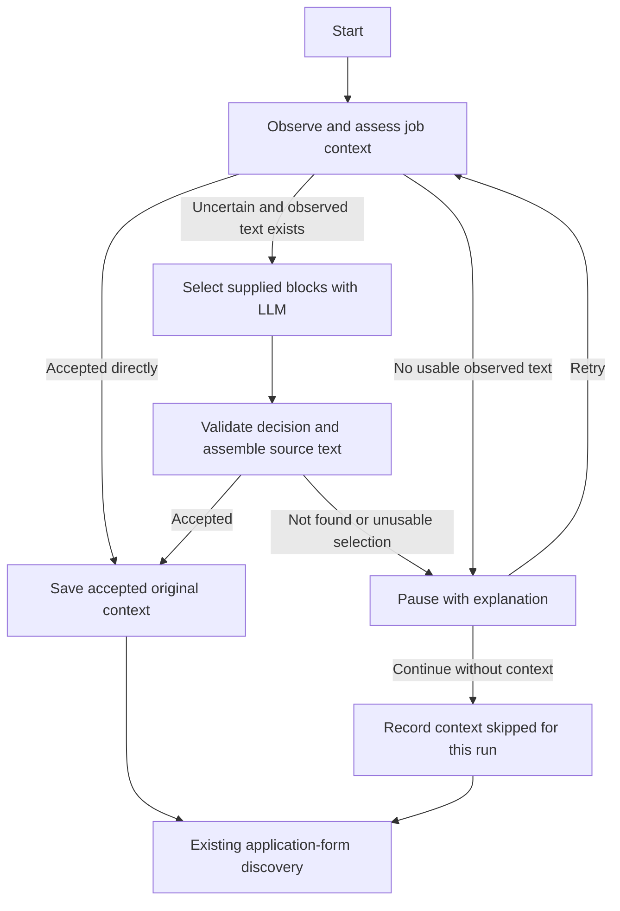

# Job context acquisition implementation plan

Status: historical proposal; larger design deferred. Reviewed at the 2026-10-03 checkpoint. The block/candidate implementation was simplified at the user's request. Read [the simple context walkthrough](job-context-first-increment.md) for current behavior. This document does not describe the current implementation or require all these mechanisms. Add refinements only when a concrete example demonstrates the need. The next proposed change is a small keyword acceptance rule, not a return to this full design.

## Goal and scope

Acquire the original job description on the starting job-details page before application navigation. Keep description text faithful to the source, with enough evidence to explain its selection. An LLM can select observed sections; it must not write or summarize the description.

The three user-visible outcomes are:

| Outcome | Behavior |
| --- | --- |
| Context acquired | Save accepted context and continue to application-form discovery |
| Context missing, paused | Explain the problem and offer Retry or Continue without context |
| Context missing, ignored | Record that the user skipped context for this run, then continue |

Pause is the default. Ignore requires an explicit choice for the current run. A page-access failure remains a technical failure because the extension cannot reliably inspect the next phase either. Model unavailability leaves context unresolved and offers retry/skip with that explanation.

This phase includes local extraction, context-specific graph routing, and one authenticated LLM selection fallback. A broader second selection attempt is a later, measured increment. Filling fields, uploading files, RAG, application submission, scanner-wide renaming, and Python API work are outside this phase.

## Baseline before the first increment

These descriptions record the implementation before the simplification. Source links open today's files; they do not reproduce that historical version.

| File | Behavior when this plan was written | Motivation for the original proposal |
| --- | --- | --- |
| [capture-job-description.ts](/Users/filipemendes/Documents/ragnarok/apps/job-extension/src/content/capture-job-description.ts) | Returns the first non-empty match from six selectors; otherwise reads the immediate parent of a recognized English heading if its text has at least 40 characters | An early fragment can win; wrappers can hide the actual section from this strategy; related sections are not assembled |
| [scan-page.ts](/Users/filipemendes/Documents/ragnarok/apps/job-extension/src/content/application/scan-page.ts) | Collects fields, actions, and description in one page scan | Context acquisition has no independent observation or success decision |
| [discovery-graph.ts](/Users/filipemendes/Documents/ragnarok/apps/job-extension/src/discovery/discovery-graph.ts) | Preserves the first non-empty description during the scan node; continues when none exists | A non-empty string becomes accepted context without quality evidence, and missing context cannot pause the flow |
| [App.tsx](/Users/filipemendes/Documents/ragnarok/apps/job-extension/src/sidepanel/App.tsx) | Manual scanning replaces context with fresh non-empty text; discovery preserves its first text | The two entry points have different acceptance/preservation policies |
| [discovery-storage.ts](/Users/filipemendes/Documents/ragnarok/apps/job-extension/src/sidepanel/discovery-storage.ts) | Stores context in Chrome session storage under a tab key; validates shape and length | Stored text has no acquisition method, selected sections, or truncation evidence; shape validation even allows an empty description |

The reader at that time skipped hidden nodes and several element types, including complete `form` and `header` subtrees. It capped the string at 20,000 characters. These choices bounded output but could also omit legitimate published description text. It made no model request and did not parse `JobPosting` JSON-LD.

The scanner test at that time verified filtering and the length cap. Graph tests verified preservation and basic URL separation. Those results did not establish extraction accuracy across representative job pages. The current [verification checkpoint](job-extension-tutorial.md#19-current-verification-checkpoint) likewise does not provide a measured extraction-accuracy percentage.

## What confidence means here

Keep three questions separate:

1. **Collection fidelity:** Did each block preserve the source text it represents, including lists and paragraphs?
2. **Collection coverage:** Did we observe all relevant sections within our supported page scope, or did timing, exclusions, unsupported DOM structures, or limits omit them?
3. **Selection correctness:** Do the chosen blocks belong to this job and contain its description rather than company navigation or another vacancy?

A collector can preserve a block perfectly while missing a qualifications section elsewhere. A model cannot select that omitted section. Likewise, valid JSON and valid block IDs do not prove semantic selection correctness.

Use inspectable evidence instead of an invented confidence percentage:

| Evidence | Proposed treatment |
| --- | --- |
| One validated `JobPosting` matching the current job, with a substantial description and no conflicting identity | Strong candidate for direct acceptance |
| An explicit job-description container coherent with the page's job identity | Candidate for direct acceptance after content and ambiguity checks |
| A heading match, a generic `itemprop="description"`, a short fragment, or competing descriptions | Insufficient by itself; collect surrounding evidence and use fallback |
| Collection or output limits reached | Record which source was affected; a selected description cut off by a limit cannot be auto-accepted |
| Empty or heading-only content | Reject and explain |

No rule proves universal completeness. Direct acceptance is a conservative heuristic, to be evaluated against annotated examples. If incomplete observations prevent an acceptable decision, pause rather than silently claim acquisition succeeded.

## Proposed observation and extraction

### 1. Observe the starting page independently

Introduce a context-only content entry point and build output. It reads job context without detecting actions, retaining action snapshots, or clicking. The Chrome adapter verifies the active tab and cancellation, injects this collector, and runtime-validates its serializable result.

An observation contains an ID, source URL, capture time, page title, available job identity, candidate descriptions, text blocks, and coverage diagnostics. Missing job identity stays unknown; it is never invented from a URL slug.

Use a short bounded readiness window for delayed rendering. Compare description-related observations, rather than the existing fields/actions fingerprint. Do not wait for constant completion of the entire DOM. After the window expires, evaluate the last observation and report any unresolved timing issue. Cookies can be dismissed manually before Retry.

### 2. Read explicit structured data

Read `application/ld+json` scripts as data. Parse into `unknown`, then narrow validated shapes. Handle individual objects, arrays, and bounded `@graph` structures. Malformed JSON in one script must not abort other extraction sources.

Look for `JobPosting` and its description, with available title, employer, URL, or job identifier to disambiguate the posting. Normalize HTML description text in an inert parser without inserting it into the live document. Multiple postings need identity matching; selecting the first object is not sufficient.

Google documents the description field as the full job description in HTML. This is useful explicit page metadata, but publishers can still supply incomplete or outdated data. [JobPosting documentation](https://developers.google.com/search/docs/appearance/structured-data/job-posting)

### 3. Collect text blocks conservatively

Identify candidate job containers and main content regions, then collect ordinary text blocks from paragraphs, lists, and section boundaries. Preserve document order and associate each block with its structural section and heading path, including nested heading wrappers. Include headingless text.

An illustrative boundary interface is:

```ts
interface JobTextBlock {
  id: string;
  order: number;
  text: string;
  headingPath: string[];
  sectionId: string | null;
  truncated: boolean;
}
```

Blocks are disjoint where possible. Do not send overlapping copies of a paragraph, its containing section, and the whole article. Split unusually long blocks at paragraph or sentence boundaries and retain their section association.

Remove scripts, styles, clearly identified navigation, duplicate text, and interactive control content. Do not read applicant input values. Avoid excluding an entire form or header wrapper solely by tag name when it contains published job text.

English phrases help prioritize sections; they do not decide which text exists in the inventory. Preserve unfamiliar headings and headingless sections for model selection. Keep neighboring sections so responsibilities are not isolated from qualifications or working arrangements.

Initially, the supported scope is the top-level ordinary DOM plus its structured job data. Frames, shadow-root traversal, and description-opening automation remain unsupported. Record observed limits instead of implying a complete page crawl.

### 4. Assess direct candidates

Move candidate acceptance into pure, named functions. Guards should explain rejections, such as `isHeadingOnlyCandidate` or `hasConflictingJobIdentity`.

Check source evidence, meaningful body text, relation to the current job, conflicts, and truncation. Deduplicate equivalent descriptions before treating several matches as ambiguous. Preserve relevant related sections instead of returning at the first heading match.

Strong unambiguous evidence can produce accepted context locally. Weak or competing evidence produces a request for selection, with reasons. A text-length threshold alone never authorizes success.

## LLM selection and its boundary

Build a bounded request from the immutable observation. Send text blocks, headings, section relationships, and available job identity. Prioritize candidate sections and their neighbors. Keep the broader collected inventory locally so budget omission is distinguishable from failure to observe any text.

Ask the model to select every relevant supplied block for this job, preserve source meaning, treat page content as data, and return `not_found` when evidence is insufficient. Its response is a small decision:

```json
{
  "observationId": "context-observation-1",
  "outcome": "found",
  "blockIds": ["b3", "b4", "b5"]
}
```

The response schema also permits `not_found` with no selected IDs. The server validates schema and membership in the supplied ID set. The extension validates the response again, checks the active tab and source URL, compares a fresh job-content fingerprint, orders and deduplicates IDs, and assembles normalized original text locally. The fingerprint includes normalized job identity and observed text, excluding timestamps and random observation IDs. If that content changed during inference, reject the old decision and reacquire. The returned observation ID is correlation metadata, not authentication.

Use model output only to decide selection. Valid IDs prevent fabricated source references; they do not prove that the model chose all the right sections. Preserve selection evidence and evaluate semantic errors separately.

OpenRouter supports JSON-schema output on compatible endpoints. Support and strict enforcement vary by endpoint, so model selection includes verifying that capability. [Structured outputs documentation](https://openrouter.ai/docs/guides/features/structured-outputs)

The current web generator streams free text and has no schema-output request contract. Introduce a narrow structured-selection adapter/service rather than forcing this workflow through the persisted chat service. Reuse provider configuration and established error/usage mechanics where appropriate. Keep existing chat generation behavior unchanged.

The web route authenticates, bounds and validates transport input, calls the service, and maps typed errors. The service owns selection validation, prompt version, and model limits. No repository or migration is necessary for this phase.

Requests originate from the extension panel to one configured web backend. Provider credentials stay on the server. Chrome requires the extension to declare the relevant backend host permission. [Chrome cross-origin requests](https://developer.chrome.com/docs/extensions/develop/concepts/network-requests)

The existing chat route rejects other origins and the extension has no authenticated API connection today. Before live model integration, verify a real signed-in extension-to-web request with explicit backend/extension-origin configuration. Do not assume existing browser cookies automatically provide a working extension session, weaken the chat route, or create an unauthenticated paid-model endpoint. If the session transport is unsuitable, resolve that authentication design before enabling live fallback.

## Graph routing and persistence



Technical access errors and cancellation retain stopped/error handling; this diagram shows acquisition outcomes. Provider timeout or unavailability explains unresolved selection and offers retry/skip. Changing the active tab or source job while inference is pending invalidates the old observation.

Separate context outcome from overall discovery status. Distinguish a context-decision pause from an action-selection pause in guards and UI handlers. Reuse the existing browser-compatible checkpoint mechanism; do not make every helper its own graph node.

Once acquired or explicitly skipped, application navigation does not repeatedly re-enter context acquisition. Retain accepted context across application routes. A new run verifies saved job identity and source evidence, not merely the tab ID. A skipped run must not display a previous job's description.

Keep Chrome session storage for accepted context, with acquisition method, source evidence, and truncation metadata. Use a versioned payload so legacy descriptions without evidence are treated as unverified candidates for reassessment. Keep full block inventories transient. Reuse a model decision only for the same unchanged observation during the run.

During migration, the legacy scan's `jobDescription` field may remain for inspector compatibility. It is raw candidate text and cannot independently authorize accepted context. Manual Scan page and graph discovery use the same assessment functions; only automation needs to pause before navigation. A scanner-wide contract rename is deferred.

## Implementation order and review points

### Milestone 1: contracts and visible evidence

Define interfaces for observations, blocks, accepted context, issues, and model decisions. Separate collected candidates from accepted descriptions. Add runtime validators and context-specific guards. Establish per-observation IDs and versioned storage compatibility.

Done when fixtures demonstrate the three user outcomes and malformed boundary payloads are rejected. Review the contracts and one example observation before building model calls.

### Milestone 2: local collector and deterministic assessment

Extract reusable text-reading helpers, implement structured data and section collection, and add a context-only injection entry point. Make direct-candidate acceptance pure and explainable. Add the bounded readiness wait. Show the observation and acceptance reason in the inspector for learning.

Done when fixtures cover heading wrappers, headingless sections, multiple relevant sections, translated headings, malformed/multiple structured postings, unrelated company snippets, published text in form/header wrappers, duplicated content, and collection limits. Assert source text and expected block relationships independently of the extractor's output.

### Milestone 3: first-phase graph and user decisions

Add context acquisition before the existing application scan. Implement missing-context pause, retry, explicit skip, and preservation after success. Update manual scan integration and storage together. Keep field/action recognition and navigation rules unchanged.

Done when graph tests prove that no application action is clicked before acquisition or explicit skip; retry recollects the current page; pauses resume through the correct handler; navigation preserves accepted text; and another job cannot inherit the context.

### Milestone 4: one bounded model fallback

First implement and test an injected selector interface with controlled responses. Then add the web service, structured provider adapter, transport DTOs, and authenticated extension connection. Select a low-cost compatible model after comparing accuracy and latency on the same examples.

Done when valid selection reconstructs exact normalized source text; unknown/duplicate/empty IDs, stale observations, invalid responses, unavailable providers, timeouts, and cancellation have explicit behavior. Verify authenticated and rejected requests, input/output limits, and real Chrome integration. Mocked Chrome tests alone do not establish permissions or session compatibility.

### Milestone 5: measure and tune

Use roughly 15–20 representative, anonymized job-page examples with manually annotated expected sections. Separate development fixtures from held-out pages. Compare the hybrid approach with a cleaned-page LLM baseline using the same model and page content.

Measure collector coverage, wrong-job acceptance, missing required sections, deterministic acceptance correctness, model-call frequency, typical and p95 latency, input/output tokens, and cost per acquired context. Also evaluate genuinely absent descriptions. Do not treat low fallback frequency as success when incomplete text is being accepted.

Done when the report explains actual failures and supports the direct-acceptance rules and model choice. Record usage and timings without logging whole page content by default.

### Later increment: broader fallback when justified

Enable one broader selection attempt only if annotated failures show that useful observed blocks were omitted from the first request. Include those additional blocks within a larger explicit budget. If collection itself missed the description, fix collection or pause; a second request with the same evidence is not recovery.

Keep a maximum of one model call per acquisition attempt initially. A measured broader fallback can raise this to at most two. Retry is a user action and starts a new bounded attempt. Input bytes, block counts, token allowance, output size, wall-clock deadlines, and character limits must be configurable and enforced at their owning boundaries. Character counts are not exact token counts.

## Proposed file responsibilities

Paths below are relative to `/Users/filipemendes/Documents/ragnarok`. This table records the original proposed responsibilities. The [increment walkthrough](job-context-first-increment.md#file-by-file-review-checklist) identifies implemented context files. Context readiness waiting and context model selection remain proposed; the separate action-selection backend is already implemented. Create a file only when its responsibility needs independent testing or an execution boundary.

| Path | Change and reason |
| --- | --- |
| `apps/job-extension/src/shared/job-context.ts` | New serializable contracts and boundary validation for context, separate from application controls |
| `apps/job-extension/src/content/collect-job-context.ts` | Coordinate structured candidates, section inventory, and coverage diagnostics |
| `apps/job-extension/src/content/read-job-text.ts` | Reusable DOM text/section mechanics shared by extraction sources |
| `apps/job-extension/src/content/read-job-posting.ts` | Bounded JSON-LD parsing and current-job disambiguation |
| `apps/job-extension/src/content/context-entry.ts` | Context-only Chrome injection entry point |
| `apps/job-extension/src/content/capture-job-description.ts` | Adapt the legacy raw-string wrapper to shared extraction; remove first-match acceptance from the authoritative context path |
| `apps/job-extension/src/shared/job-context-rules.ts` | Pure candidate assessment and selection-validation rules |
| `apps/job-extension/src/discovery/discovery-graph.ts` | Add acquisition routes before application navigation and preserve accepted context afterward |
| `apps/job-extension/src/discovery/session.ts`, `guards.ts`, `routes.ts` | Add typed acquisition outcomes, effect interfaces, and distinct context/action pause handling |
| `apps/job-extension/src/sidepanel/browser-discovery-port.ts` | Implement context observation/readiness and model selection effects |
| `apps/job-extension/src/sidepanel/App.tsx`, `DiscoveryPanel.tsx` | Use one acquisition policy and display preview, provenance, reason, retry, and skip |
| `apps/job-extension/src/sidepanel/discovery-storage.ts` | Validate and persist accepted versioned evidence; treat legacy context as unverified |
| `apps/job-extension/package.json`, `public/manifest.json` | Build the context entry point and declare only the required backend access |
| `apps/web/src/shared/job-context-selection.ts` | Minimal request/response transport shapes and validation |
| `apps/web/src/server/modules/job-context/` | Selection service, prompt, typed errors, and runtime composition |
| `apps/web/src/server/llm/openrouter-context-selector.ts` | Schema-output provider adapter, cancellation, limits, and usage metadata |
| `apps/web/src/app/api/extension/job-context/select/route.ts` | Thin authenticated transport boundary with explicit extension-origin policy |
| Each application's `tests/unit/...` and applicable integration tests | Mirror source responsibilities; protect extraction, routing, validation, authorization, and failure behavior |
| `docs/job-extension-tutorial.md`, `docs/job-extension-discovery.md` | Update current-behavior explanations after each implemented milestone |

Reuse strict TypeScript, LangGraph, Chrome APIs, browser DOM parsing, and the web application's existing Zod dependency. No new framework, database table, ingestion workflow, or retrieval dependency is required. Provider capability, authentication transport, and budget settings are implementation decisions that must be verified rather than assumed.

For each milestone, show what changed, why, one concrete observation or transition, and the focused verification performed. Run affected checks and builds after implementation; this documentation-only plan requires link and formatting verification.
