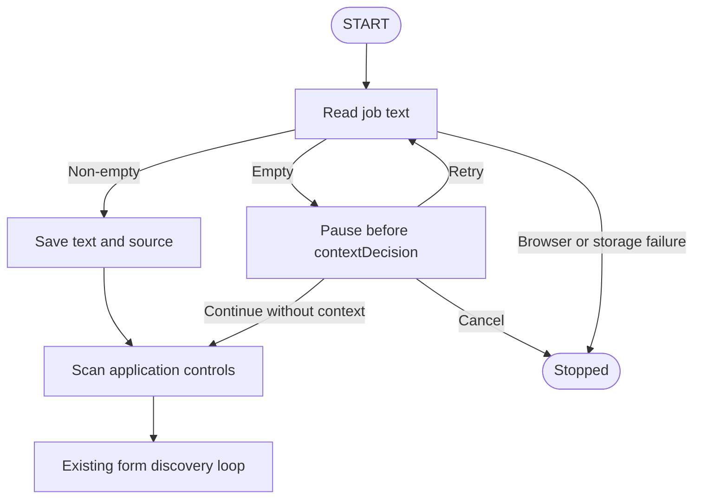

# Learning the simple context-acquisition increment

Read [capture-job-description.ts](/Users/filipemendes/Documents/ragnarok/apps/job-extension/src/content/capture-job-description.ts) first. It owns the extraction algorithm in one file. Then read the first two nodes in [discovery-graph.ts](/Users/filipemendes/Documents/ragnarok/apps/job-extension/src/discovery/discovery-graph.ts). Those are the context flow.

The previous increment introduced blocks, candidates, assessment, JSON-LD parsing, identity matching, and provenance before we had established whether simple capture was sufficient. Those parts have been removed. This version reads a string, keeps it across navigation, and pauses when it is empty.

## 1. Read the text

`captureJobDescription` tries the existing description selectors and returns the first non-empty result. Otherwise it reads the first main/article region, or the page body when neither exists.

`readDescription` walks that region's child nodes. Text nodes contribute their original text. `isExcludedTextNode` skips hidden elements, scripts, navigation, page-level headers, footers, controls, and editable answers.

Inline markup stays joined: `Type<strong>Script</strong>` becomes `TypeScript`. Paragraphs, list items, headings, and common containers add newline boundaries. The final pass trims each line, collapses whitespace, removes empty lines, and joins the remaining lines. The existing 20,000-character cap remains.

Published text inside a form or article header can be included; input values and editable answers are excluded. The context entry and controls scanner call this same reader.

There is no ranking or quality score. Non-empty text establishes capture. Main/body fallback can include company information or unrelated public text. Inspect the displayed string and refine the reader from actual misses.

## 2. Return the string across the browser boundary

[context-entry.ts](/Users/filipemendes/Documents/ragnarok/apps/job-extension/src/content/context-entry.ts) calls the reader as its final expression. The build emits it as `context-script.js`.

The panel cannot read the job page through its own `document`. [scan-active-tab.ts](/Users/filipemendes/Documents/ragnarok/apps/job-extension/src/sidepanel/scan-active-tab.ts) injects the entry into the job tab, receives its result as `unknown`, and checks that it is a bounded string. It checks the active tab and rejects a URL change while reading.

Empty text returns null. Otherwise `readJobContext` adds page metadata:

```ts
interface JobContext {
  jobDescription: string;
  sourceUrl: string;
  lastPageUrl: string;
  capturedAt: string;
}
```

This is the one context interface in [job-context.ts](/Users/filipemendes/Documents/ragnarok/apps/job-extension/src/shared/job-context.ts). It preserves where the text came from and supports matching-page restoration. Its validator checks this small storage shape.

The [browser port](/Users/filipemendes/Documents/ragnarok/apps/job-extension/src/sidepanel/browser-discovery-port.ts) exposes `readContext` with cancellation checks before and after the Chrome operation. It contains no extraction rules.

## 3. Continue, pause, or skip

The first graph edge remains `START → acquireContext`.



`acquireJobContext` reads through the port. Its empty-context guard clears old stored text and returns a context pause. Otherwise it saves the capture and continues. Browser or storage exceptions stop the run.

`contextDecision` runs after the checkpoint is resumed. Retry reads again. Skip sets `contextSkipped: true` and continues. Null cancels. `contextResponse` carries the explicit input; `pauseReason` distinguishes this pause from selecting an application action.

| User outcome | State |
| --- | --- |
| Acquired | `context` contains text and its source |
| Missing and paused | Null context, paused status, context pause reason |
| Missing and ignored | Null context, `contextSkipped: true` |

There is no separate context observation, assessment, or outcome object. `hasResolvedJobContext` permits scanning and clicking after capture or explicit skip. Later scans preserve the string and update its last page URL. Fresh discovery reads context again.

## 4. Inspect and refine gradually

[App.tsx](/Users/filipemendes/Documents/ragnarok/apps/job-extension/src/sidepanel/App.tsx) uses the same reader for manual inspection and graph discovery. The panel displays the text and source, plus Retry/Continue without context/Cancel when discovery pauses.

Rebuild and reload the unpacked extension. Open a job-details page and select Scan page to inspect the capture. Then use Find application form to see the first context stage in the trace.

Refinements should follow actual failures. Unrelated text suggests improving the extraction region; missing sections suggest improving traversal; delayed rendering suggests a bounded wait. Competing descriptions or unreliable extraction can justify selection rules or an LLM later.

Frames, shadow roots, description-opening automation, JSON-LD, context model selection, and RAG remain future work. Action selection already has a separate model fallback; it does not select or validate description text.

The next proposed context refinement is a small acceptance rule requiring at least two distinct job-description keyword groups, such as role overview, responsibilities, requirements, and qualifications. It has not been implemented: the current gate accepts any non-empty capture. Keep that change separate from extraction so a rejected capture can still be inspected.

## File-by-file review checklist

| File | Change |
| --- | --- |
| [AGENTS.md](/Users/filipemendes/Documents/ragnarok/AGENTS.md) | Require small observable increments and defer speculative abstractions and tests during iterative development. |
| [capture-job-description.ts](/Users/filipemendes/Documents/ragnarok/apps/job-extension/src/content/capture-job-description.ts) | Own the selector/main/body reader and filtering. |
| [context-entry.ts](/Users/filipemendes/Documents/ragnarok/apps/job-extension/src/content/context-entry.ts) | Return the reader's string from injection. |
| [job-context.ts](/Users/filipemendes/Documents/ragnarok/apps/job-extension/src/shared/job-context.ts) | Reduce five context interfaces to one small context shape. |
| [session.ts](/Users/filipemendes/Documents/ragnarok/apps/job-extension/src/discovery/session.ts) | Remove observation/assessment/outcome fields; keep context, skip flag, and response. |
| [guards.ts](/Users/filipemendes/Documents/ragnarok/apps/job-extension/src/discovery/guards.ts) | Resolve the gate from captured context or explicit skip. |
| [discovery-graph.ts](/Users/filipemendes/Documents/ragnarok/apps/job-extension/src/discovery/discovery-graph.ts) | Read and save text or pause through the empty-context guard. |
| [scan-active-tab.ts](/Users/filipemendes/Documents/ragnarok/apps/job-extension/src/sidepanel/scan-active-tab.ts) | Validate the string and add page metadata. |
| [browser-discovery-port.ts](/Users/filipemendes/Documents/ragnarok/apps/job-extension/src/sidepanel/browser-discovery-port.ts) | Expose readContext with cancellation checks. |
| [discovery-storage.ts](/Users/filipemendes/Documents/ragnarok/apps/job-extension/src/sidepanel/discovery-storage.ts) | Validate and save the simpler object. |
| [App.tsx](/Users/filipemendes/Documents/ragnarok/apps/job-extension/src/sidepanel/App.tsx) | Remove observation state and assessment calls. |
| [DiscoveryPanel.tsx](/Users/filipemendes/Documents/ragnarok/apps/job-extension/src/sidepanel/DiscoveryPanel.tsx) | Show captured text and decisions; remove block/evidence JSON UI. |
| [tsconfig.json](/Users/filipemendes/Documents/ragnarok/apps/job-extension/tsconfig.json) | Check application source, tests, and build/test configuration. |
| [README.md](/Users/filipemendes/Documents/ragnarok/apps/job-extension/README.md) | Describe the baseline and verification commands. |
| [architecture.md](/Users/filipemendes/Documents/ragnarok/docs/architecture.md) | Record the simpler context boundary. |
| [discovery guide](/Users/filipemendes/Documents/ragnarok/docs/job-extension-discovery.md) | Update the first edge and separate historical test results. |
| [tutorial](/Users/filipemendes/Documents/ragnarok/docs/job-extension-tutorial.md) | Replace superseded context explanations. |
| [acquisition plan](/Users/filipemendes/Documents/ragnarok/docs/job-context-acquisition-plan.md) | Mark the larger design deferred. |

Removed source files: `collect-job-context.ts`, `read-job-text.ts`, `read-job-posting.ts`, and `job-context-rules.ts`.

At the 2026-10-03 checkpoint, the context tests were adapted to this simple reader and single `JobContext` contract. Tests for the removed block/candidate APIs were replaced. All 97 extension unit tests, typechecking, and the production build passed. See the [tutorial's verification checkpoint](job-extension-tutorial.md#19-current-verification-checkpoint) for the full extension/backend results and their limits.
