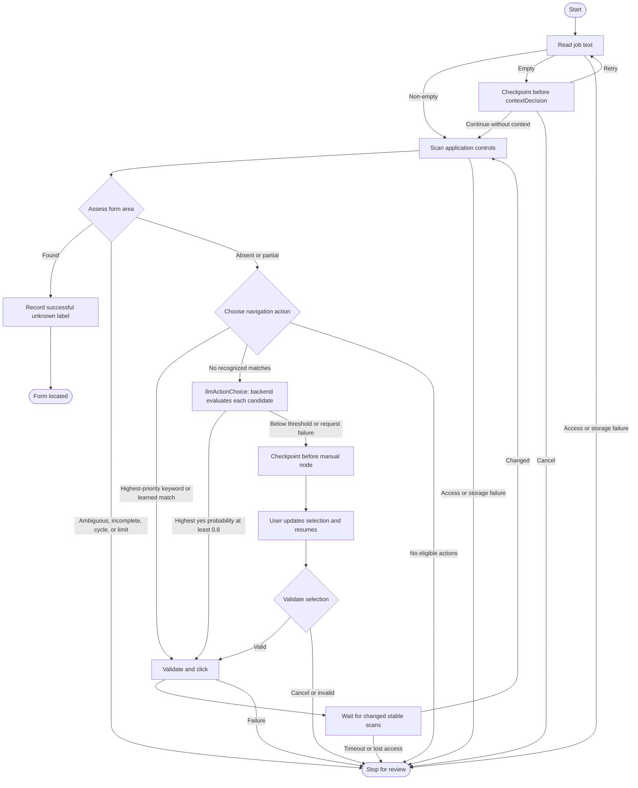

# Learning the application discovery graph

For the full implementation walkthrough, read the [job extension tutorial](job-extension-tutorial.md). It traces observations, keyword learning, description capture, every graph node, Chrome effects, panel state, storage, and tests. It distinguishes the implemented Jev action selection from proposed RAG and filling integration.

The [simple context walkthrough](job-context-first-increment.md) explains the first edge. The [scanning increment](job-extension-scanning.md) follows collection, labels, grouping, and form assessment through the reorganized files.

This phase uses LangGraph.js 1.4.18 locally in the extension. Chrome exposes browser operations through JavaScript, so a Python orchestration API would still require the same extension adapter plus network exchanges for observations and commands. Scanning stays local. Unresolved action selection makes one bounded model request through Next.js; the graph itself still runs in the panel.

The browser port uses direct `fetch` to call `POST /api/extension/select-action`, reusing the main app's account session. See the [first backend increment](job-extension-backend-first-increment.md) for setup and the complete request flow.

LangGraph.js has a maintained 1.x release and a browser entry point. Its state graph, conditional edges, streaming, and memory checkpoints cover this phase. Browser async context and browser-session recovery still need explicit attention, as the pause mechanism below demonstrates.

## Stage 1: deterministic rules

Start with `src/content/application/scan-page.ts` to see the observation pipeline. Then read `src/shared/form-discovery.ts` for form/CV decisions and `src/shared/discovery-rules.ts` for action matching and fingerprints. The shared rules know nothing about Chrome or LangGraph.

- Form recognition accepts applicant name, email, and at least one file control in the same area. `required` flags are unrelated to recognition. Two complete areas are ambiguous; two signals in one area are partial evidence. Partial results retain their detected field indexes and continue to action discovery.
- CV selection prefers a labelled resume-autofill upload, then another labelled resume, then the first file not explicitly identified as a cover letter, certificate, or portfolio. There is no two-upload limit. A missing CV candidate does not invalidate the form.
- Deterministic action selection normalizes expressions, prefers explicit apply/start/begin phrases over generic application sections and learned phrases, then uses scan index for ties. Learned labels remain exact matches scoped to their origin. No recognized match proceeds to Jev, which evaluates each eligible action independently in one request; the highest yes probability must reach `0.8`. Otherwise manual choice is available. Submit, upload, disabled, non-web, and new-tab actions are excluded before either selection path.
- Page fingerprints compare URL and field/action metadata, excluding random scan IDs and capture timestamps. They support progress and cycle detection.

Study these rules through the inspector and trace. The checkpoint unit tests now cover these rules against the current scanner and context contracts.

## Stage 2: state, nodes, and edges

Read `src/discovery/session.ts`, then `src/discovery/discovery-graph.ts`.

`DiscoverySession` is plain serializable state: scan, preserved description, recognition result, candidates, previous action, click count, and visited states. DOM elements stay inside the injected scanner, outside graph state.

`Annotation.Root` declares one channel, `session`. Nodes return new session objects; the default channel behavior replaces the previous value. This workflow does not need message history or a custom reducer. More granular channels can be added when parallel updates require them.

Nodes are ordinary named functions. `addNode`, `addEdge`, and `addConditionalEdges` supply execution and routing. `DiscoveryPort` describes browser effects; production uses Chrome, while tests supply fixed page sequences and controlled failures. The interface makes workflow tests independent of live websites.

Read a node as precondition guards, its operation, then its resulting session. `src/discovery/guards.ts` names workflow conditions such as `hasPageScan` and `hasLearnablePreviousAction`. Type predicates also narrow nullable state, so passing a guard makes the scan or action available to TypeScript. Guards only inspect values; nodes retain effects and failure messages.

`src/discovery/routes.ts` names each edge decision. For example, `routeAfterAssessment` returns `learn` when the form is found, ends a stopped run, and otherwise returns `choose`. These routes replace nested ternaries without changing the graph.

Domain guards stay beside their rules. `isEligibleNavigationAction` is in `src/shared/discovery-rules.ts`; name/email/file matching and CV priority are in `src/shared/form-discovery.ts`. Scan validators keep separate guards for identity, labels, control metadata, and select options. `src/shared/value-guards.ts` shares only primitive boundary checks.

Guard order preserves behavior: complete form evidence wins before truncation, click limits, or cycle checks; all areas are inspected before accepting a unique form, while a second complete area immediately establishes ambiguity. Label resolution still prioritizes ARIA, HTML labels, upload triggers, and nearby text. Even an empty visible upload trigger prevents nearby text from replacing it. Manual scanning refreshes descriptions, while a discovery run retains its first captured description.

The acquisition node reads context before the controls scan. Empty text pauses unless the user explicitly skips context. A fresh run reads it again rather than trusting a stored preview. Later scans preserve the captured string and source URL while updating its last page URL. Manual inspection uses the same reader. A non-empty string establishes capture, not description completeness; main/body fallback can include unrelated text. A complete form satisfies the agreed recognition rule even if the controls scan is truncated; incomplete controls scans otherwise stop before navigation.

Inspect the panel's captured text and trace. At this checkpoint, run application typechecking, the unit suite, and the production build; the graph tests cover acquisition, explicit skip/retry, and manual action resume.

## Stage 3: pause and resume

The graph compiles with `MemorySaver` and `interruptBefore: ["contextDecision", "manual"]`. Unresolved context routes to the first node; uncertain action selection routes to the second. `pauseReason` and named guards distinguish the responses. The streamed session already contains the evidence and a paused status.

The panel gives each run a unique `thread_id`. After selection it calls `graph.updateState` with the chosen index, then `graph.stream(null, config)` with the same thread ID. LangGraph loads the checkpoint and runs the manual node, which validates the choice and routes to the separate click node. Cancelling supplies `null` and ends the run.

This is an explicit browser breakpoint, rather than the dynamic `interrupt()` helper. In the installed browser entry point, that helper requires implicit runnable context that the default browser async-local-storage implementation does not provide. The original tests failed with `Called interrupt() outside the context of a graph`; the static breakpoint tests pass in that same browser-oriented runtime. We avoid adding a context polyfill merely to reproduce a Node.js example.

The official documentation recommends dynamic interrupts for general human-review workflows and presents static interrupts as debugging breakpoints. This learning phase uses static breakpoints for two browser-local pauses. Revisit dynamic-interrupt support and runtime placement before adding more complex review workflows.

Memory checkpoints survive job-tab navigation while the panel remains open. They do not survive panel closure, extension reload, or browser restart. Descriptions and learned labels use separate storage. Reopening can restore job context, but starts a fresh graph without replaying old clicks.

## Stage 4: checked browser effects

`src/sidepanel/browser-discovery-port.ts` pins discovery to its starting tab and checks active-tab identity before scanning or clicking. The injected click function contains all its runtime logic because `executeScript` serializes it without its module imports.

The scanner stores a random scan ID, live elements, and captured markup in Chrome's isolated content-script world. Clicking verifies the ID, URL, connection, unchanged markup, visibility, and disabled state. It consumes the snapshot before clicking, preventing a second click through that snapshot. Native form submissions and download links are rejected. Website JavaScript can still have arbitrary behavior; action classification is a discovery heuristic, not a side-effect sandbox.

After a click, scans run every 400 ms until the fingerprint changes and remains stable for three observations. Waiting ends after 12 seconds. This handles same-origin routes and in-page dialogs without assuming a document reload. Very delayed pages may require a manual rescan. A run allows five clicks, rejects repeated states, and has an additional graph recursion limit of 50.

Cross-origin navigation ends temporary `activeTab` access; open the extension on the resulting page and start again. New tabs, frames, and shadow roots remain unsupported. Closing the panel or choosing Stop discovery aborts pending waits and prevents later graph clicks.

Only the immediately preceding transition receives success credit. A manually selected unknown label is saved when the next scan confirms the form, then reused only as the same normalized label on the same origin. One success does not establish its meaning on every route.

## Stage 5: later extensions and measured cost

The current phase stops at discovery. Deterministic matching runs in `choose`; no recognized match routes to the separate `llmActionChoice` node. `chooseActionWithLlm` calls `port.selectActionWithLlm`; the backend currently uses Jev through OpenRouter. An accepted action records source `llm`; otherwise the graph pauses before manual choice. Backend and extension logs share a request ID, with provider timing/status and every candidate's yes probability in the backend logs; see the [logging walkthrough](job-extension-backend-first-increment.md#follow-a-request-through-the-logs). Later work can add authenticated retrieval/generation calls, CV upload followed by an autofill rescan, and filling/review. Provider credentials belong on the server. Resume autofill and a required resume attachment remain separate tasks.

Before durable checkpointing, define how recovery verifies the current DOM and avoids click replay. A saved graph cannot restore the browser page or prove whether a side effect already happened.

The production build keeps LangGraph in a lazily loaded local chunk. The injected context entry calls the same plain-text reader as the controls scanner. The framework supports routing, streamed state, checkpoints, and explicit resume; the existing large-chunk warning remains.

## Current files and verification

The [scanning increment](job-extension-scanning.md) gives the current file-by-file refactor report and a focused reading path. The scanner now lives under `src/content/application/`; the unchanged job-text reader and reusable DOM helpers remain directly under `src/content/`.

`PageScan` in `src/shared/page-scan.ts` is the serializable observation. `FormAssessment` in `src/shared/form-discovery.ts` is the decision about its fields. The graph uses that assessment to finish, continue toward an application action, or stop for review. No additional graph nodes or dependencies were added for collection and labelling.

The 2026-10-03 checkpoint passed `npm run typecheck`, `npm run test`, and `npm run build` in both applications, plus web lint. The extension passed 97 unit tests using the current paths/contracts; the web passed 132 unit tests including the authenticated selection endpoint and provider boundary. Database integration tests were not rerun because persistence behavior was unchanged. The build retains the existing warning for the large, lazily loaded LangGraph chunk. Actual Chrome permission behavior and live employer pages still need manual inspection.

## Sources

- [LangGraph.js overview](https://docs.langchain.com/oss/javascript/langgraph/overview)
- [Graph API](https://docs.langchain.com/oss/javascript/langgraph/graph-api)
- [Interrupts and static breakpoints](https://docs.langchain.com/oss/javascript/langgraph/interrupts)
- [LangGraph.js releases](https://github.com/langchain-ai/langgraphjs/releases)
- [Chrome activeTab permission](https://developer.chrome.com/docs/extensions/develop/concepts/activeTab)
