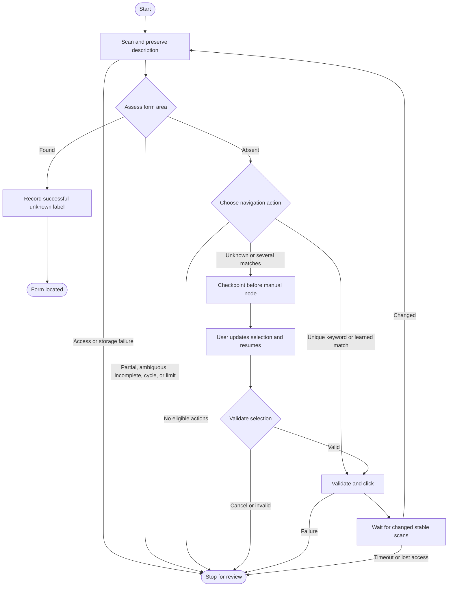

# Learning the application discovery graph

For the full implementation walkthrough, read the [job extension tutorial](job-extension-tutorial.md). It traces observations, keyword learning, description capture, every graph node, Chrome effects, panel state, storage, and tests. It also separates the existing backend from proposed RAG and model integration.

This phase uses LangGraph.js 1.4.18 locally in the extension. Chrome exposes browser operations through JavaScript, so a Python orchestration API would still require the same extension adapter plus network exchanges for observations and commands. Scanning and graph routing currently make no server requests. Later model calls will have their own latency.

LangGraph.js has a maintained 1.x release and a browser entry point. Its state graph, conditional edges, streaming, and memory checkpoints cover this phase. Browser async context and browser-session recovery still need explicit attention, as the pause mechanism below demonstrates.

## Stage 1: deterministic rules

Start with `apps/job-extension/src/shared/discovery-rules.ts`. These functions know nothing about Chrome or LangGraph.

- Form recognition accepts applicant name, email, and at least one file control in the same area. `required` flags are unrelated to recognition. Two complete areas are ambiguous; two signals in one area are partial evidence.
- CV selection prefers a labelled resume-autofill upload, then another labelled resume, then the first file not explicitly identified as a cover letter, certificate, or portfolio. There is no two-upload limit. A missing CV candidate does not invalidate the form.
- Action selection normalizes expressions and requires one application-opening match. Learned labels are exact matches scoped to their origin. Multiple matches pause. Submit, upload, disabled, non-web, and new-tab actions are excluded.
- Page fingerprints compare URL and field/action metadata, excluding random scan IDs and capture timestamps. They support progress and cycle detection.

From `apps/job-extension`, run `npm run test -- tests/unit/shared/discovery-rules.test.ts`.

## Stage 2: state, nodes, and edges

Read `src/discovery/session.ts`, then `src/discovery/discovery-graph.ts`.

`DiscoverySession` is plain serializable state: scan, preserved description, recognition result, candidates, previous action, click count, and visited states. DOM elements stay inside the injected scanner, outside graph state.

`Annotation.Root` declares one channel, `session`. Nodes return new session objects; the default channel behavior replaces the previous value. This workflow does not need message history or a custom reducer. More granular channels can be added when parallel updates require them.

Nodes are ordinary named functions. `addNode`, `addEdge`, and `addConditionalEdges` supply execution and routing. `DiscoveryPort` describes browser effects; production uses Chrome, while tests supply fixed page sequences and controlled failures. The interface makes workflow tests independent of live websites.

Read a node as precondition guards, its operation, then its resulting session. `src/discovery/guards.ts` names workflow conditions such as `hasPageScan` and `hasLearnablePreviousAction`. Type predicates also narrow nullable state, so passing a guard makes the scan or action available to TypeScript. Guards only inspect values; nodes retain effects and failure messages.

`src/discovery/routes.ts` names each edge decision. For example, `routeAfterAssessment` returns `learn` when the form is found, ends a stopped run, and otherwise returns `choose`. These routes replace nested ternaries without changing the graph.

Domain guards stay beside their rules in `src/shared/discovery-rules.ts`. `isEligibleNavigationAction` reads as a list of exclusions, and CV selection returns in priority order. Scan validators keep separate guards for identity, labels, control metadata, and select options. `src/shared/value-guards.ts` shares only primitive boundary checks.

Guard order preserves behavior: complete form evidence wins before truncation, click limits, or cycle checks; all areas are inspected before accepting a unique form. Label resolution still prioritizes ARIA, HTML labels, upload triggers, and nearby text. Even an empty visible upload trigger prevents nearby text from replacing it. Manual scanning refreshes descriptions, while a discovery run retains its first captured description.

The scan node captures the description once and retains it across routes, with its source URL and capture time. A saved context is reused for a new run only if its last page URL matches the initial scan. Missing description text does not block form discovery. Description extraction remains a bounded heuristic. A complete form satisfies the agreed recognition rule even if the scan is truncated; incomplete scans otherwise stop before navigation.

Run `npm run test -- tests/unit/discovery/discovery-graph.test.ts`. The streaming test shows the node sequence across navigation.

## Stage 3: pause and resume

The graph compiles with `MemorySaver` and `interruptBefore: ["manual"]`. An uncertain choice routes to that node and pauses before it executes. The streamed session already contains its candidates and a paused status.

The panel gives each run a unique `thread_id`. After selection it calls `graph.updateState` with the chosen index, then `graph.stream(null, config)` with the same thread ID. LangGraph loads the checkpoint and runs the manual node, which validates the choice and routes to the separate click node. Cancelling supplies `null` and ends the run.

This is an explicit browser breakpoint, rather than the dynamic `interrupt()` helper. In the installed browser entry point, that helper requires implicit runnable context that the default browser async-local-storage implementation does not provide. The original tests failed with `Called interrupt() outside the context of a graph`; the static breakpoint tests pass in that same browser-oriented runtime. We avoid adding a context polyfill merely to reproduce a Node.js example.

The official documentation recommends dynamic interrupts for general human-review workflows and presents static interrupts as debugging breakpoints. This learning phase deliberately uses a static breakpoint for one browser-local pause. Revisit dynamic-interrupt support and runtime placement before adding more complex review workflows.

Memory checkpoints survive job-tab navigation while the panel remains open. They do not survive panel closure, extension reload, or browser restart. Descriptions and learned labels use separate storage. Reopening can restore job context, but starts a fresh graph without replaying old clicks.

## Stage 4: checked browser effects

`src/sidepanel/browser-discovery-port.ts` pins discovery to its starting tab and checks active-tab identity before scanning or clicking. The injected click function contains all its runtime logic because `executeScript` serializes it without its module imports.

The scanner stores a random scan ID, live elements, and captured markup in Chrome's isolated content-script world. Clicking verifies the ID, URL, connection, unchanged markup, visibility, and disabled state. It consumes the snapshot before clicking, preventing a second click through that snapshot. Native form submissions and download links are rejected. Website JavaScript can still have arbitrary behavior; action classification is a discovery heuristic, not a side-effect sandbox.

After a click, scans run every 400 ms until the fingerprint changes and remains stable for three observations. Waiting ends after 12 seconds. This handles same-origin routes and in-page dialogs without assuming a document reload. Very delayed pages may require a manual rescan. A run allows five clicks, rejects repeated states, and has an additional graph recursion limit of 50.

Cross-origin navigation ends temporary `activeTab` access; open the extension on the resulting page and start again. New tabs, frames, and shadow roots remain unsupported. Closing the panel or choosing Stop discovery aborts pending waits and prevents later graph clicks.

Only the immediately preceding transition receives success credit. A manually selected unknown label is saved when the next scan confirms the form, then reused only as the same normalized label on the same origin. One success does not establish its meaning on every route.

## Stage 5: later extensions and measured cost

The current phase stops at discovery. Later work can add a bounded model-selection node before manual review, authenticated retrieval/generation calls, CV upload followed by an autofill rescan, and filling/review. Provider credentials belong on the server. Resume autofill and a required resume attachment remain separate tasks.

Before durable checkpointing, define how recovery verifies the current DOM and avoids click replay. A saved graph cannot restore the browser page or prove whether a side effect already happened.

The browser build separates an approximately 924 KB graph chunk from approximately 238 KB of initial inspector JavaScript. Both ship locally inside the extension. The added cost is framework loading and execution; the visible benefits are routing, streamed state, checkpoints, and explicit resume. Sizes can change with dependencies and code changes.

## File-by-file changes and verification

All paths below are relative to `apps/job-extension`.

| File | Responsibility and verification |
| --- | --- |
| `package.json` | Add LangGraph and its core peer dependency for orchestration. |
| `package-lock.json` | Lock the installed runtime; the browser build verifies it bundles. |
| `public/manifest.json` | Add storage permission and describe discovery. |
| `src/shared/application-form.ts` | Extend and runtime-validate scan metadata, grouping, descriptions, and link targets. Boundary tests reject malformed results. |
| `src/shared/value-guards.ts` | Share record, nullable-string, and non-negative-integer checks at untrusted boundaries. |
| `src/shared/discovery-rules.ts` | Implement recognition, CV priorities, exact action matching, and fingerprints. Rule tests cover successful and rejected cases. |
| `src/content/dom.ts` | Associate hidden uploads with visible DOM-supported triggers. |
| `src/content/detect-fields.ts` | Include associated hidden uploads and autocomplete evidence. |
| `src/content/resolve-labels.ts` | Keep upload-trigger evidence distinct from nearby text. |
| `src/content/assign-field-areas.ts` | Group native forms and coherent non-form containers. |
| `src/content/detect-actions.ts` | Include semantic tabs and link metadata; retain live elements in the scanner only. |
| `src/content/capture-job-description.ts` | Capture recognized bounded sections and exclude UI/applicant text. |
| `src/content/scan-snapshot.ts` | Type isolated-world references used for click verification. |
| `src/content/scan-application-form.ts` | Compose the scan and register its snapshot. Scanner tests cover uploads, grouping, descriptions, and existing inventory behavior. |
| `src/content/click-scanned-action.ts` | Reject stale, changed, hidden, submitting, and consumed actions. Focused tests protect against duplicate execution. |
| `src/discovery/session.ts` | Define typed session state, preserved job context, and the browser-effect interface. |
| `src/discovery/guards.ts` | Name pure workflow preconditions and narrow scan/action state. |
| `src/discovery/routes.ts` | Map guarded session outcomes to the next graph node. |
| `src/discovery/discovery-graph.ts` | Execute bounded discovery with conditional routes and checkpointed manual selection. Graph tests exercise success, pause/resume, learning, and failure handling. |
| `src/sidepanel/scan-active-tab.ts` | Expose pinned-tab scanning and checks while retaining manual scanning. |
| `src/sidepanel/browser-discovery-port.ts` | Implement checked clicking, polling, cancellation, and storage effects. Controlled-time tests cover stable progress, timeout, tab changes, and abort. |
| `src/sidepanel/discovery-storage.ts` | Validate descriptions and bounded site-scoped labels before reuse. Storage tests cover corruption, size limits, and deduplication. |
| `src/sidepanel/DiscoveryPanel.tsx` | Show preserved context, CV evidence, manual choices, and execution steps. |
| `src/sidepanel/App.tsx` | Lazy-load graphs, stream state, update checkpoints, resume, and prevent overlapping operations. |
| `src/sidepanel/styles.css` | Add wrapping controls and bounded text/trace layouts. |
| `src/background/entry.ts` | Clear context when its tab closes. |
| `tests/unit/support/application-fixtures.ts` | Build typed scan fixtures without private applicant data. |
| `tests/unit/content/scan-application-form.test.ts` | Extend scanner coverage while retaining privacy and label tests. |
| `tests/unit/content/click-scanned-action.test.ts` | Protect consumed snapshots, stale IDs, changed targets, and submission rejection. |
| `tests/unit/shared/application-form.test.ts` | Test the expanded transport boundary. |
| `tests/unit/shared/discovery-rules.test.ts` | Test grouping, CV priorities, ambiguity, and origin-scoped learning. |
| `tests/unit/discovery/discovery-graph.test.ts` | Exercise actual LangGraph execution with controlled browser effects. |
| `tests/unit/sidepanel/browser-discovery-port.test.ts` | Verify polling and cancellation with controlled time. |
| `tests/unit/sidepanel/discovery-storage.test.ts` | Reject corrupted context/labels and verify bounded, deduplicated label storage. |
| `README.md` | Explain usage, permissions, storage, and limitations. |

`docs/architecture.md` updates the extension's responsibilities without changing the web or worker architecture. This guide supplies the staged walkthrough and Mermaid graph.

The initial phase passed `npm run check` with 40 tests and `npm run build`. A Playwright browser fixture with a mocked Chrome bridge verified deterministic navigation, preserved description, hidden resume detection, manual pause/resume, successful label learning, and automatic reuse on a fresh run. This did not verify Chrome's actual permission UI or a live employer website.

The guard refactor passes `npm run check` with 46 tests and `npm run build`. It adds regression coverage for complete-form precedence, retaining the first description, label precedence, empty upload triggers, field/select validation, and executing the serialized click function without imports. The build retains the existing warning for the large, lazily loaded LangGraph chunk.

## Sources

- [LangGraph.js overview](https://docs.langchain.com/oss/javascript/langgraph/overview)
- [Graph API](https://docs.langchain.com/oss/javascript/langgraph/graph-api)
- [Interrupts and static breakpoints](https://docs.langchain.com/oss/javascript/langgraph/interrupts)
- [LangGraph.js releases](https://github.com/langchain-ai/langgraphjs/releases)
- [Chrome activeTab permission](https://developer.chrome.com/docs/extensions/develop/concepts/activeTab)
