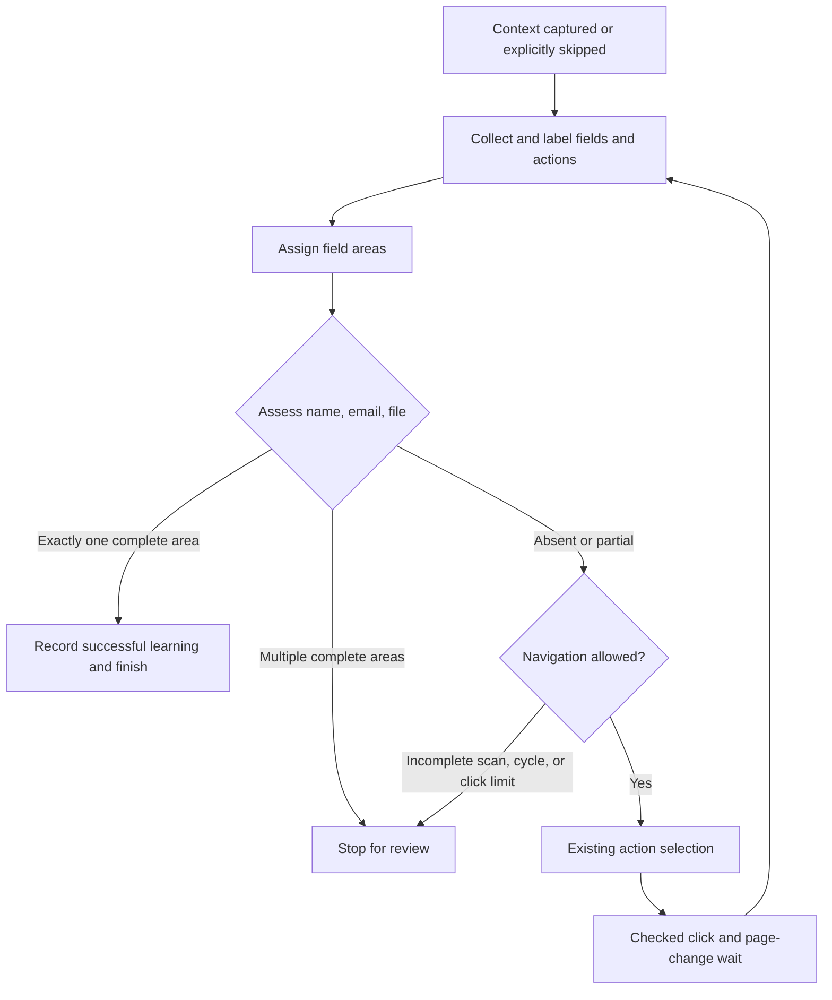

# Application scanning: this increment

Job context remains as implemented in the [first context increment](job-context-first-increment.md). Once the graph captures it or the user skips it, the next phase observes the page's controls. This increment simplifies that observation and the decision about whether an application area exists.

Previously, field collection, labelling, and grouping lived in three files. Form recognition, CV selection, action keywords, and fingerprints shared another file. The page observation was called `ApplicationForm` even when no application form existed. Partial recognition discarded the detected indexes and stopped navigation.

Now the reading order is:

```text
scan-page.ts
  scanFields → collect, label, assign areas
  scanActions → collect and label
  return PageScan
form-discovery.ts
  assess name + email + file in each area
discovery-graph.ts
  finish, continue to action selection, or stop for review
```

## 1. Start with the coordinator

Open [scan-page.ts](/Users/filipemendes/Documents/ragnarok/apps/job-extension/src/content/application/scan-page.ts). Its public `scanPage` function builds a map of native forms, calls the two scanners, registers the action snapshot, and returns a `PageScan`.

`scanFields` and `scanActions` share the form map so a field and button owned by the same native form receive the same `formIndex`. The returned scan contains plain metadata. The snapshot keeps live action elements in the page so a later checked click can target the observed element.

The coordinator still uses the existing description reader. It does not replace the context preserved by the graph. We have not changed context acquisition in this increment.

The injected [entry.ts](/Users/filipemendes/Documents/ragnarok/apps/job-extension/src/content/application/entry.ts) ends with `scanPage()`. Chrome returns that expression's result to the panel. The graph also has a node named `scanPage`: that node calls `port.scan()`, which injects this entry into the job page. The two functions run in different browser environments.

## 2. Follow the field scanner from its top

Open [scan-fields.ts](/Users/filipemendes/Documents/ragnarok/apps/job-extension/src/content/application/scan-fields.ts). Its public function shows three steps directly:

1. Query `FIELD_SELECTOR`, skip unsupported controls, and collect each element with its metadata.
2. Resolve the collected fields' labels and fieldset legends.
3. Assign an area key, then return the metadata without the DOM elements.

The named helpers below that function implement these operations. You can read the flow before opening any helper. The old `detect-fields.ts`, `resolve-labels.ts`, and `assign-field-areas.ts` are replaced by this file.

The collection guards preserve existing behavior: skip hidden/button/submit/reset/image inputs, skip duplicate inputs inside a combobox, and skip invisible controls. A hidden file input remains inspectable when an associated upload trigger is visible. There is still a 200-field limit, and native select options remain bounded to 50.

Label priority remains `aria-labelledby` → `aria-label` → native HTML label → upload trigger → short nearby text. Nearby text is bounded to an isolated control and two parent levels. These rules protect the existing scanner's label evidence; this increment adds no new matching heuristics.

Labels come before grouping because grouping outside a native form uses name/email/file evidence. Fresh metadata is mutated while assembling this one observation. The completed observation is then treated as input by the graph, whose nodes return new session objects.

### What the indexes mean

| Property | Meaning |
| --- | --- |
| `index` | Position in this scan's field inventory; not a permanent element ID |
| `formIndex` | Index of the owning native `<form>` in `document.forms`, or null |
| `areaKey` | Group used for recognition: `form:0`, `area:0`, or null |

Fields with native ownership receive `form:<formIndex>`. Other fields walk up their parents until they find a form/dialog container or a container holding all three recognition signals. Body and html are excluded. Unassigned fields remain visible in the inventory but do not prove an application area.

This preserves the current grouping baseline. A generic container holding only two signals may remain unassigned; partial evidence is recognized within an established area. We can refine grouping after observing a concrete page that needs it.

## 3. Collect and label actions

Open [scan-actions.ts](/Users/filipemendes/Documents/ragnarok/apps/job-extension/src/content/application/scan-actions.ts). Its public function queries buttons, links, button-like inputs, and supported ARIA actions. Guards exclude invisible actions, combobox controls, and nested duplicates. Each remaining element receives a label and action metadata.

Action label priority remains referenced ARIA text → explicit ARIA label → input alt/value → element text. The result contains metadata plus a parallel element array. Action index 2 corresponds to element 2 in the snapshot. The 100-action limit remains.

This scanner inventories actions. Keyword eligibility and choosing an application-opening action remain in `discovery-rules.ts`; no click occurs during a scan.

## 4. Decide whether an application area exists

Open [form-discovery.ts](/Users/filipemendes/Documents/ragnarok/apps/job-extension/src/shared/form-discovery.ts). `assessApplicationForm` groups enabled fields by area, then directly finds a name field, an email field, and file inputs in each group. It counts those three signals without intermediate evidence interfaces.

| Result | Meaning | Next graph step |
| --- | --- | --- |
| `found` | Exactly one area has name, email, and at least one file input | Record successful action learning and finish discovery |
| `partial` | No complete area; an established area has two signals | Report the missing signal and try action selection |
| `absent` | No complete or two-signal area | Try action selection |
| `ambiguous` | More than one complete area | Stop for review |

A complete area takes priority over partial ones. The assessor accepts a unique complete area only after checking the other groups. Once it finds a second complete area, ambiguity is already established and it returns immediately. If several areas are partial, it keeps the first in scan order.

For example, name and email without an upload produce a partial assessment containing their indexes and an empty `fileIndices` array. `getMissingFormSignals` reads those existing properties and returns `file input`. The trace and panel use that helper; there is no additional partial-result model.

Name/email expression matching remains unchanged. File proof remains based on input type. The rule does not require those controls to carry the HTML `required` attribute.

CV selection also remains unchanged: exclude explicitly labelled cover letters, certificates, and portfolios; prefer a resume upload mentioning autofill, then another labelled resume, then the first remaining upload. There is no two-upload cap. This selects a candidate for a later phase; it does not upload a CV or invoke autofill.

## 5. Follow the assessment back into the graph

Open `assessForm` in [discovery-graph.ts](/Users/filipemendes/Documents/ragnarok/apps/job-extension/src/discovery/discovery-graph.ts). It stores the assessment, then continues through the existing guards for incomplete scans, ambiguous complete areas, the five-click budget, and repeated page states.

Partial recognition reaches `chooseAction` when those guards allow navigation. It selects the highest-priority recognized action, breaking ties by scan index. If no label matches, `llmActionChoice` asks the backend to evaluate eligible candidates; a below-threshold result or request failure pauses for manual choice. After a checked click and page-change wait, scanning starts again. The graph retains the latest assessment even when the budget or cycle guard stops the run.



The diagram abbreviates action selection, its manual pause, and browser failures. See the [full graph guide](job-extension-discovery.md) for those branches.

## Files changed in this increment

| File | Change |
| --- | --- |
| `src/content/application/entry.ts` | Move the scanner entry and call `scanPage` |
| `src/content/application/scan-page.ts` | Replace the old coordinator with two explicit scanner calls |
| `src/content/application/scan-fields.ts` | Combine collection, label resolution, and area assignment |
| `src/content/application/scan-actions.ts` | Move action collection and labelling; expose the public flow first |
| `src/content/application/scan-snapshot.ts` | Move the existing snapshot contract without changing it |
| `src/content/application/click-scanned-action.ts` | Move the existing checked click without changing its guards |
| `src/shared/page-scan.ts` | Rename `ApplicationForm`/`isApplicationForm` to `PageScan`/`isPageScan`; retain validation |
| `src/shared/form-discovery.ts` | Separate form/CV rules; simplify assessment and retain partial evidence |
| `src/shared/discovery-rules.ts` | Retain action rules, normalization, scan limits, and fingerprints |
| `src/discovery/discovery-graph.ts` | Continue partial matches to action selection and report the missing signal |
| `src/discovery/session.ts` | Use `PageScan` and import the assessment from its new location |
| `src/discovery/guards.ts` | Use the renamed scan contract |
| `src/sidepanel/scan-active-tab.ts` | Validate injected results with `isPageScan` |
| `src/sidepanel/browser-discovery-port.ts` | Update the scan type and moved click import |
| `src/sidepanel/App.tsx` | Use scan terminology for the observation state and props |
| `src/sidepanel/DiscoveryPanel.tsx` | Display the missing signal for a partial area |
| `package.json` | Point build/watch scripts to the moved scanner entry |
| `README.md` and extension guides | Update source paths, reading order, and partial routing |
| `docs/architecture.md` | Record the scanner folder and rule boundaries |
| `docs/job-context-acquisition-plan.md` | Update its coordinator source link after the move |

The scanning refactor added no dependencies or graph nodes and preserved context acquisition and checked-click behavior. Later action-selection changes are described in the [backend guide](job-extension-backend-first-increment.md).

At the 2026-10-03 checkpoint, scanner, click, form-recognition, and graph tests were adapted to the current paths and contracts. All 97 extension unit tests, typechecking, and the production build passed. See the [tutorial's verification checkpoint](job-extension-tutorial.md#19-current-verification-checkpoint) for the full results. Fixture tests do not establish coverage of every live employer page.
