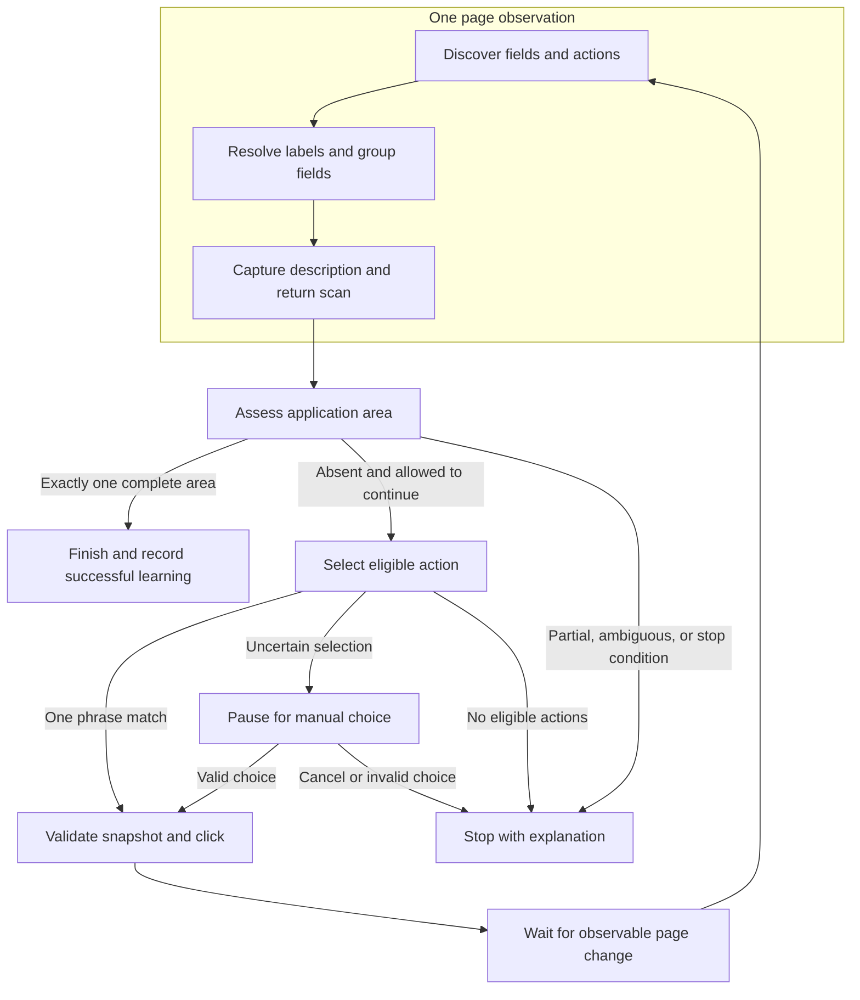
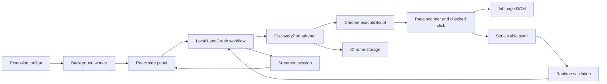
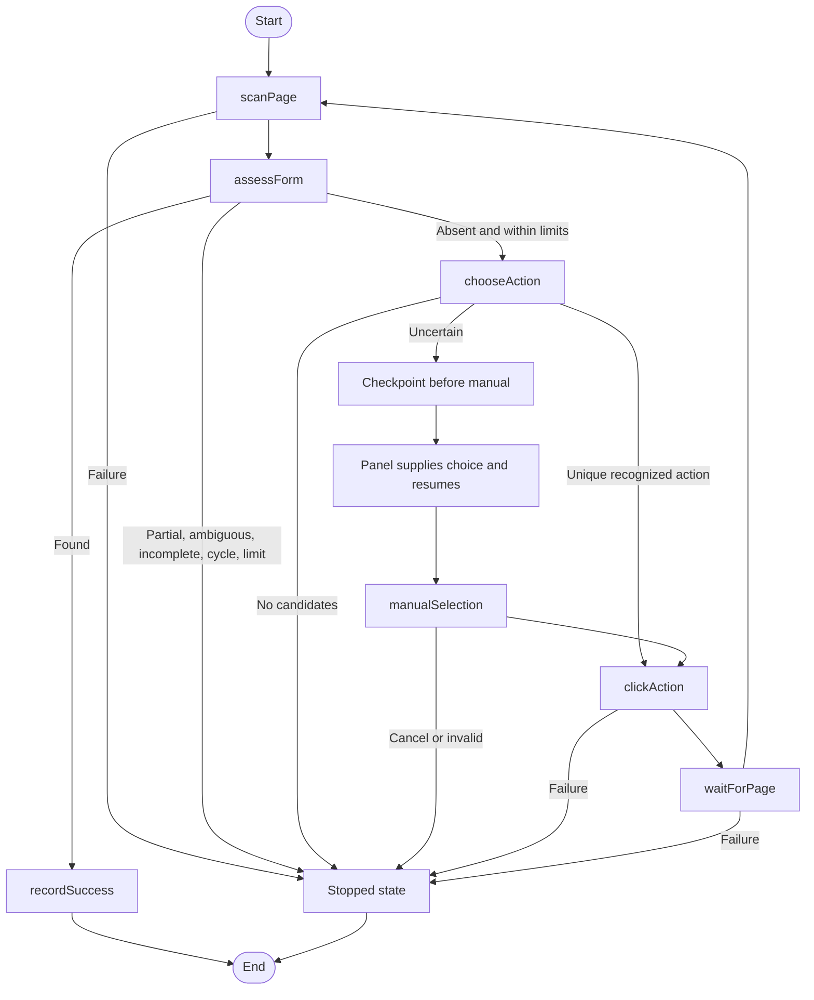
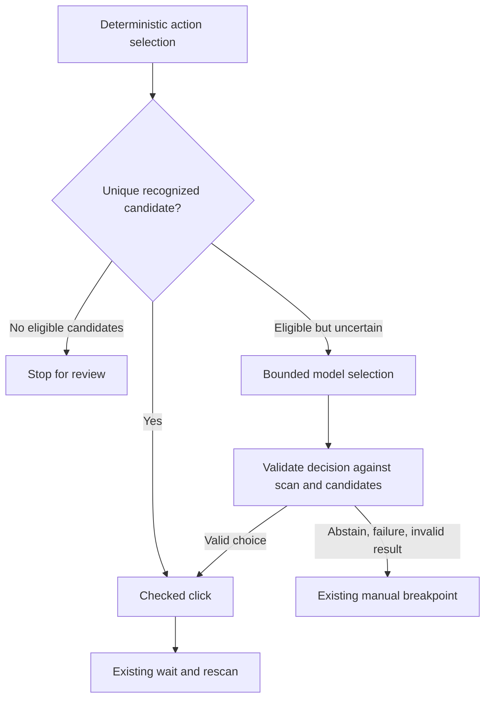

# Job extension implementation tutorial

This tutorial describes the implementation in this checkout on 2026-10-02. It follows data through the code, explains the decisions behind it, and separates existing behavior from proposed work. The shorter [discovery guide](job-extension-discovery.md) remains a quick reference.

Source links point to this local checkout so you can open the implementation beside the tutorial.

For a focused reading path:

- [An incremental way to understand the implementation](#build-and-study-one-observable-phase-at-a-time)
- [Browser forms, ownership, and indexes](#native-html-forms-and-application-areas-are-different)
- [Reading the regular expressions](#read-the-whitespace-regular-expressions)
- [Where the action snapshot lives](#where-the-snapshot-is-stored)
- [Keywords and successful-click learning](#7-follow-an-apply-action-through-keyword-checking)
- [Description capture and its misses](#9-why-description-capture-sometimes-returns-an-empty-string)
- [State updates and every graph node](#10-session-state-guards-and-graph-updates)
- [The web app boundary and proposed LLM phases](#15-connect-the-extension-to-the-existing-web-application)
- [Tests and diagnosing failures](#19-use-tests-as-executable-lessons)

## 1. What we have built

The extension can inspect a job page, capture recognized description text, navigate toward an application form, and stop when one area contains applicant name, email, and a file input.

Its application discovery loop is:

```text
observe page
assess form evidence
select a navigation action
validate and click
wait for observable progress
observe again
```

The extension also pauses when its action choice is uncertain. A person can choose a candidate and resume the same run.

Today, this is a deterministic browser workflow with human selection. It has no model, prompt, model-selected tools, RAG request, or generated application answer. LangGraph runs the state machine; installing it does not itself introduce an LLM.

In the broad software sense, the loop observes an environment and acts toward a goal. In the LLM architecture terminology used here, call it an application discovery workflow. A future model could select an action or request evidence within this bounded flow. LangGraph's own documentation distinguishes predetermined workflows from agents that dynamically decide processes and tool use. [Workflows and agents](https://docs.langchain.com/oss/javascript/langgraph/workflows-agents)

### Build and study one observable phase at a time

The runtime order and the development order are different. At runtime, an implemented graph executes its nodes. During development, we can define that graph's intended stages first, then implement and inspect one stage at a time. A working loop does not require every helper to become a graph node.

The current code already contains the phases below. This is a teaching sequence for studying it and making later improvements; it is not a claim that these were separate historical implementation milestones.

| Step | Implement or study | Visible result before proceeding | Current location |
| --- | --- | --- | --- |
| 1 | Define the goal, state contract, nodes, and conditional edges | A diagram showing when we continue, pause, succeed, or stop | `discovery/session.ts`, `discovery/graph.ts`, `discovery/routes.ts` |
| 2 | Discover supported fields and actions | Two inventories for a known page, without clicking | `content/detect-fields.ts`, `content/detect-actions.ts` |
| 3 | Resolve labels and establish field ownership/areas | Each control has its available label evidence and grouping metadata | `content/resolve-labels.ts`, `content/dom.ts`, `content/assign-field-areas.ts` |
| 4 | Capture job text and preserve it across navigation | Description text remains available after leaving the job details area | `content/capture-job-description.ts`, the graph's `scanPage`, `sidepanel/discovery-storage.ts` |
| 5 | Assess name, email, and file evidence in each area | An explicit `found`, `partial`, `ambiguous`, or `absent` result | `shared/discovery-rules.ts`, the graph's `assessForm` |
| 6 | Select an eligible action using built-in or learned phrases, with manual selection when uncertain | A candidate and its selection source, before dispatching a click | `shared/discovery-rules.ts`, `chooseAction`, `manualSelection` |
| 7 | Validate and click one observed action; wait and rescan | One verified navigation cycle | `content/scan-snapshot.ts`, `content/click-scanned-action.ts`, `sidepanel/browser-discovery-port.ts` |
| 8 | Repeat with limits, checkpoints, and successful-click learning | A bounded run that stops at a recognized area or an explained failure | `discovery/graph.ts`, `discovery/guards.ts`, `sidepanel/App.tsx` |

For step 1, start with the contracts and a sketch of the graph. A small test adapter can supply observations while the browser implementation is incomplete. Section 19 shows how the existing graph tests do that. This lets you understand orchestration without simultaneously learning DOM traversal, Chrome injection, and React state.

For steps 2–5, keep one scan observable: inspect its raw controls, then labels, then areas, then assessment. Use the same small HTML example at each stage. Once those observations make sense, follow one click and one rescan before studying the repeated loop.

There is one current implementation detail to keep in mind: `detectActions` already resolves action labels during discovery. Field labels have a separate `resolveLabels` pass. The conceptual phase list separates responsibilities; it does not imply that both inventories currently use the same label-resolution function.

The scanner functions belong together because they inspect the same document and produce one observation. LangGraph's `scanPage` node calls that pipeline through `DiscoveryPort`. The graph then makes decisions about the observation. Splitting `detectFields` and `resolveLabels` into separate graph nodes would add state transitions without giving these synchronous DOM helpers a useful independent execution boundary today.



This diagram omits individual failure edges for readability; section 11 shows the current graph's routes in more detail. It also describes the current manual fallback. A model fallback would be a later explicit phase, not a hidden part of scanning or label resolution.

## 2. The three browser environments

The extension has three JavaScript environments with different responsibilities.

| Environment | Responsibility | Lifetime |
| --- | --- | --- |
| Background service worker | Handle toolbar clicks, open the panel, remove closed-tab context | Chrome manages its activation |
| React side panel | Own UI, graph execution, cancellation, and storage calls | While the panel is open |
| Injected content script | Inspect the job page DOM and retain references for a checked click | Associated with the page document |

The panel can call Chrome APIs, but its `document` is the panel document. It cannot inspect the job page by calling `document.querySelector` locally.

`chrome.scripting.executeScript` bridges the environments. A scanner executes against the job page and returns serializable metadata. Live DOM elements stay in the content script's isolated world.



### Startup and build files

[public/manifest.json](/Users/filipemendes/Documents/ragnarok/apps/job-extension/public/manifest.json) registers the service worker and side panel. It requests `activeTab`, `scripting`, `sidePanel`, and `storage`. There is no permanently registered scanner or current backend connection in this manifest.

[background/entry.ts](/Users/filipemendes/Documents/ragnarok/apps/job-extension/src/background/entry.ts) opens the panel from the toolbar click. Its initial `setPanelBehavior` call resets an older automatic-opening setting so the click listener handles the action. The tab-removal listener deletes `jobContext:<tabId>`; it does not clear learned labels.

`activeTab` gives temporary page access following the user's extension interaction. That access persists across navigation within the same origin and is revoked when navigating to another origin. Our workflow stops at that boundary and asks the user to open the extension on the resulting page. [Chrome activeTab](https://developer.chrome.com/docs/extensions/develop/concepts/activeTab)

[sidepanel/main.tsx](/Users/filipemendes/Documents/ragnarok/apps/job-extension/src/sidepanel/main.tsx) finds the panel's root element and mounts `App`. A missing root is an invalid startup condition, so it throws.

[package.json](/Users/filipemendes/Documents/ragnarok/apps/job-extension/package.json) uses Vite for the React panel and esbuild for the scanner and worker. The built outputs are `dist/index.html`, panel assets, `content-script.js`, and `service-worker.js`. The graph is loaded dynamically when discovery starts, keeping its dependency bundle out of the panel's initial execution path.

## 3. Understand the data before following the functions

Read [shared/application-form.ts](/Users/filipemendes/Documents/ragnarok/apps/job-extension/src/shared/application-form.ts).

Despite its name, `ApplicationForm` represents a page scan. A scan can contain no form, several forms, and unrelated page controls.

`PageScan` would communicate this responsibility more accurately. An application-area assessment would remain a separate result. That rename is proposed here; the interface and its callers have not been changed.

| Contract | What it represents |
| --- | --- |
| `ApplicationField` | Metadata about one supported control |
| `ApplicationAction` | Metadata about one button, link, or supported semantic action |
| `ApplicationForm` | Page identity, description text, both inventories, and truncation flags |
| `ApplicationOption` | A native select's option label and value |

### Native HTML forms and application areas are different

A native form is an actual `<form>` element in the page's HTML. An application area is our interpretation of a group of fields: applicant name, email, and a file control. A site can implement that area inside a `<div>` or dialog, without using a native form.

`document.forms` lists only the document's **`<form>` elements**. It does not list every element in the document. The quoted tooltip appears to have omitted the tag from its sentence. Its type, `HTMLCollectionOf<HTMLFormElement>`, says that each entry is a native form object. [MDN: Document.forms](https://developer.mozilla.org/en-US/docs/Web/API/Document/forms)

Consider this deliberately small page:

```html
<form id="newsletter">
  <label>Newsletter email <input type="email" name="newsletterEmail"></label>
</form>

<form id="application">
  <label>Full name <input type="text" name="fullName"></label>
  <label>Email <input type="email" name="email"></label>
  <label>CV <input type="file" name="resume"></label>
</form>

<button id="application-submit" type="submit" form="application">Submit application</button>
<a id="open-application" href="/apply">Apply now</a>
```

In this example:

```ts
document.forms.length; // 2
document.forms[0].id; // "newsletter"
document.forms[1].id; // "application"
```

The inputs, labels, button, and link are not entries in `document.forms`. The scanner discovers supported controls separately with selectors in `detect-fields.ts` and `detect-actions.ts`. It uses the forms collection only to establish native-form identity.

`HTMLCollection` is a browser collection, rather than a regular JavaScript array. `HTMLCollectionOf<HTMLFormElement>` is TypeScript's more specific description of its entries. `read-only` means the property is not something we replace by assigning a new collection; it does not mean the page's forms cannot change.

### A control's `form` property means ownership

For a native button, `button.form` returns its owning `HTMLFormElement`, or `null` when it has no native form owner. `HTMLFormElement | null` is TypeScript's way of saying that either result is possible. [MDN: HTMLButtonElement.form](https://developer.mozilla.org/en-US/docs/Web/API/HTMLButtonElement/form)

Ownership usually comes from a containing `<form>`. It can also come from an explicit `form="application"` attribute referencing a form's ID elsewhere in the same document. In the example above, the submit button is outside the application form but still belongs to it. [MDN: form attribute](https://developer.mozilla.org/en-US/docs/Web/HTML/Reference/Attributes/form)

```ts
const submitButton = document.getElementById("application-submit");

if (submitButton instanceof HTMLButtonElement) {
  submitButton.form?.id; // "application"
  submitButton.closest("form"); // null: it has no form ancestor
}
```

The `instanceof` guard verifies that the retrieved element is a native button before accessing button-specific properties. The optional chaining in `form?.id` reads the ID only if an owner exists.

This distinction explains `getFormIndex` in [content/dom.ts](/Users/filipemendes/Documents/ragnarok/apps/job-extension/src/content/dom.ts). It uses native `.form` ownership for inputs, selects, textareas, and buttons. For other supported elements, such as a link or a generic ARIA control, it falls back to `closest("form")`.

The property is read-only, but an HTML attribute is a different interface: changing a valid `form` attribute can change ownership. Reading `.form` itself does not submit, validate, or click anything.

### Walk through the native form-to-index map

The current helper is:

```ts
export function getFormIndices(): Map<HTMLFormElement, number> {
  return new Map(Array.from(document.forms, (form, index) => [form, index]));
}
```

Read it from the inside outward:

1. `document.forms` provides the native form objects in document order.
2. `Array.from` visits the collection and calls its callback with each form and its zero-based position.
3. The callback returns a pair: `[theActualFormObject, itsPosition]`.
4. `new Map` turns those pairs into lookups from a form object to a number.

For the example page, the map contains `newsletterFormObject → 0` and `applicationFormObject → 1`. These keys are actual DOM objects, not the strings `"newsletter"` and `"application"`.

Later, `getFormIndex` obtains a control's owner and asks `indices.get(owner)` for its number. This translates a live DOM relationship into a small serializable value. Several fields can share the same form number:

| Inventory | Control | Its `index` | Its `formIndex` | Its field `areaKey` |
| --- | --- | --- | --- | --- |
| Fields | Newsletter email | 0 | 0 | `form:0` |
| Fields | Applicant full name | 1 | 1 | `form:1` |
| Fields | Applicant email | 2 | 1 | `form:1` |
| Fields | CV upload | 3 | 1 | `form:1` |
| Actions | External submit button | 0 | 1 | Not an action property |
| Actions | Apply link | 1 | `null` | Not an action property |

The submit button is discovered as an action, but the navigation rules reject it as a native form submit control. Detection records what exists; later eligibility rules decide what we can use to navigate.

There are three independent numbering systems here: positions in the field inventory, positions in the action inventory, and positions in the native forms collection. Field index 1 and action index 1 do not identify the same thing. Form index 1 means the second native form, not the second control and not an HTML `id`.

For a custom application area, the fields can have `formIndex: null` while sharing `areaKey: "area:0"`. That `0` is assigned by our container map, independently of native form indexes. A null native owner is therefore not enough to conclude that no application area exists.

All of these numbers and area keys belong to one scan. DOM changes can change their assignments. They are grouping and lookup metadata, not durable identities to store for a future page visit.

### Identity and provenance

`index` is the position in the current inventory. It is not a permanent element identifier. After a new scan, index 3 can refer to a different element.

`formIndex` identifies a native form within that scan. `areaKey` groups fields for recognition. For example, `form:0` represents the first native form and `area:0` represents a detected container without a native form element.

`labelSource` records how a label was obtained. An HTML label and a nearby-text guess are different kinds of evidence, even when their text looks similar.

`scanId` connects returned action metadata to the live element references retained in the page. A click requires the corresponding snapshot; an index alone is insufficient.

`pageOrigin` scopes learned labels. `pageUrl` identifies the current route and helps verify saved context and detect progress.

### Compile-time types and runtime validation

An interface helps TypeScript check our own code. It does not verify a value returned across the Chrome boundary.

[scan-active-tab.ts](/Users/filipemendes/Documents/ragnarok/apps/job-extension/src/sidepanel/scan-active-tab.ts) treats the injected result as `unknown`, then calls `isApplicationForm`. The validator checks field identity, labels, control metadata, native select options, action metadata, and top-level scan properties.

[shared/value-guards.ts](/Users/filipemendes/Documents/ragnarok/apps/job-extension/src/shared/value-guards.ts) provides the reused record, nullable-string, and non-negative-integer checks. These validate shapes. They do not determine whether fields belong to a real application form.

That distinction separates two questions:

- Is this value a valid scan payload?
- Does this scan contain enough evidence to recognize an application form?

The first belongs to the boundary validator. The second belongs to `assessApplicationForm`.

## 4. Follow one scan through the page

[content/entry.ts](/Users/filipemendes/Documents/ragnarok/apps/job-extension/src/content/entry.ts) calls `scanApplicationForm()`. The injected bundle finishes with that call's result, which Chrome returns to the panel.

[scanApplicationForm](/Users/filipemendes/Documents/ragnarok/apps/job-extension/src/content/scan-application-form.ts) coordinates these steps in order:

1. Build a native form-to-index map.
2. Detect supported fields and retain their elements locally.
3. Detect actions and retain their elements locally.
4. Resolve labels on the detected fields.
5. Assign field areas using labelled field evidence.
6. Create a random scan ID and retain the action snapshot.
7. Capture description text and return the serializable scan.

The order of steps 4 and 5 matters. Area recognition can use labels to identify name and email fields, so labels must exist before assigning areas.

`resolveLabels` returns the same field objects that `assignFieldAreas` subsequently modifies. That is why the final `fields` array contains the assigned area keys even though it was obtained before step 5.

This scanner mutates fresh objects it created for the current scan. Graph nodes subsequently treat completed observations as inputs and return new session objects. Those two choices serve different lifetimes and do not conflict.

### DOM helpers

[content/dom.ts](/Users/filipemendes/Documents/ragnarok/apps/job-extension/src/content/dom.ts) supplies shared DOM mechanics:

- `cleanText` collapses whitespace, trims, and caps metadata text at 200 characters. Description extraction uses its own 20,000-character limit.
- `isVisible` inspects the element and its ancestors for hidden, inert, ARIA-hidden, display, and visibility states. It does not test viewport position, occlusion, or every way an element can be visually concealed.
- `getFormIndex` uses native form ownership where supported and otherwise the closest form.
- `getAriaLabelledBy` resolves referenced IDs and joins their text.
- `getVisibleUploadTrigger` tries visible associated labels, a containing upload button, then an explicit `aria-controls` association.

These helpers provide observations. They do not select an application action.

### Read the whitespace regular expressions

Yes, `/\s+/` is a regular expression, often called a regex. A regex describes a text pattern. It does not perform an operation until a method such as `split`, `replace`, or `test` uses it.

| Syntax | Meaning |
| --- | --- |
| `/.../` | JavaScript delimiters for a regex literal |
| `\s` | A whitespace character, including a space, tab, or line break |
| `+` | One or more consecutive matches of the preceding item |
| `g` after the closing slash | Global matching, used by `replace` to replace every match |

So `/\s+/` matches a run of whitespace, such as one space, three spaces, or a newline followed by spaces. `+` refers to the preceding `\s`; it is not an addition operator inside this pattern. [MDN: character class escapes](https://developer.mozilla.org/en-US/docs/Web/JavaScript/Reference/Regular_expressions/Character_class_escape), [MDN: quantifiers](https://developer.mozilla.org/en-US/docs/Web/JavaScript/Guide/Regular_expressions/Quantifiers)

`cleanText` uses:

```ts
"Full   name\nEmail".replace(/\s+/g, " "); // "Full name Email"
```

Each whitespace run becomes one ordinary space. The `g` matters: without it, `replace` would replace only the first run. The subsequent `.trim()` removes leading and trailing whitespace, and `.slice(0, MAX_TEXT_LENGTH)` limits the metadata text length.

`getAriaLabelledBy` uses:

```ts
"name-label   required-hint".split(/\s+/); // ["name-label", "required-hint"]
```

An `aria-labelledby` attribute can refer to multiple element IDs separated by whitespace. `split` produces the individual ID strings, which the helper then resolves with `document.getElementById`. Unlike `replace`, `split` does not need a `g` flag to split at each separator.

For example, `aria-labelledby="name-label required-hint"` tells the helper to obtain text from both referenced elements and join it. These are HTML element IDs; they are unrelated to our numeric field or form indexes. `getVisibleUploadTrigger` uses the same splitting technique for the IDs listed in `aria-controls`.

You will also encounter these symbols in our keyword expressions:

| Syntax | Reading aid | Example |
| --- | --- | --- |
| `^` and `$` | Require the start and end of the input | `/^apply$/` matches `apply`, not `apply later` |
| `\|` | Alternatives | `/^(apply\|application)$/` accepts either complete word |
| `?` after an item/group | Zero or one occurrence | `/^apply( now)?$/` also accepts `apply now` |
| `(?:...)` | Group without capturing a substring | `/^(?:apply\|application)$/` groups the alternatives |
| `i` after the closing slash | Ignore letter case | `/^apply$/i` also matches `Apply` |

These simplified examples are reading aids, not replacements for the current production patterns. Section 7 walks through the actual action expressions after label normalization.

## 5. Fields, comboboxes, and labels

### Field eligibility

[content/detect-fields.ts](/Users/filipemendes/Documents/ragnarok/apps/job-extension/src/content/detect-fields.ts) queries native inputs, selects, textareas, ARIA comboboxes, and listbox-opening buttons.

Its loop reads as a list of rejection rules:

```ts
if (!(element instanceof HTMLElement)) continue;
if (isUnsupportedInput(element)) continue;
if (!isSupportedField(element)) continue;
if (isNestedComboboxField(element)) continue;
if (!isInspectableField(element)) continue;
```

Hidden inputs and button-like input types are excluded as fields. A nested input inside an ARIA combobox is excluded as a separate field to avoid representing the same logical control twice.

An invisible file input can be included when it has a visible upload trigger. Many websites hide the browser's file control behind their own button, so visibility of the input alone would miss the CV control.

`getFieldControl` resolves the control category in priority order. A native input with `role="combobox"` becomes a combobox. For a container combobox, `findComboboxInput` can obtain metadata from its inner non-hidden input.

`makeField` captures names, identifiers, placeholder, autocomplete, required state, and disabled state. It captures up to 50 native select options, with `optionCount` recording the full count. At most 200 supported fields are returned; discovering another sets `truncated`.

The scanner does not read applicant text input values or file bytes. Native select option values describe available choices. An input button's value is separately used as its action label.

### What a combobox means here

A combobox is a value-entry control with an associated popup for selecting a value. It may allow typing or only selection. A searchable country selector is a common example. [W3C combobox pattern](https://www.w3.org/WAI/ARIA/apg/patterns/combobox/)

Our scanner uses `role="combobox"` and `button[aria-haspopup="listbox"]` as detection signals. The latter is a heuristic for a custom selection control, not proof that the website implements a complete accessible combobox.

Custom popup choices are not currently opened or inventoried. Native select options are. Detecting a combobox therefore does not mean we already know how to fill it.

### Label resolution

[content/resolve-labels.ts](/Users/filipemendes/Documents/ragnarok/apps/job-extension/src/content/resolve-labels.ts) applies the first usable label source:

| Priority | Source | Example |
| --- | --- | --- |
| 1 | `aria-labelledby` | Text in referenced elements |
| 2 | `aria-label` | An explicit accessible label |
| 3 | Native HTML labels | `<label for="email">Email</label>` |
| 4 | Visible upload trigger | A button associated with a file input |
| 5 | Nearby text | A short sibling heading beside an isolated control |

`resolveFieldLabel` returns both text and source. `resolveLabels` assigns them and obtains the nearest fieldset's direct legend as `groupLabel`.

Nearby resolution is bounded to two ancestor levels. It stops at forms, body/html, or a container with more than one detected field. Interactive siblings and siblings containing controls are rejected. It searches preceding siblings; checkbox and radio fields can also use following siblings. The candidate text must be at most 120 characters.

An existing visible upload trigger with empty text returns an empty label result. Nearby text does not replace it. This preserves the stronger structural association rather than assigning an unrelated nearby heading.

## 6. Grouping and form proof

[content/assign-field-areas.ts](/Users/filipemendes/Documents/ragnarok/apps/job-extension/src/content/assign-field-areas.ts) first groups native forms by `formIndex`.

For fields without a native form, it walks upward through parents. A parent becomes an area when it contains name, email, and file signals, or has a form/dialog role. Body and html are not grouping candidates.

This prevents unrelated name, email, and upload controls scattered across a whole page from automatically proving a form. Roles can identify a partial area; recognition still evaluates its actual fields afterward.

[shared/discovery-rules.ts](/Users/filipemendes/Documents/ragnarok/apps/job-extension/src/shared/discovery-rules.ts) then supplies `assessApplicationForm`:

1. Group enabled fields with an area key.
2. Find name evidence, email evidence, and file controls within each area.
3. Record every complete matching area.
4. Return `found` for exactly one complete area, `ambiguous` for several, `partial` for an area with at least two signals, or `absent` otherwise.

It deliberately examines every area before accepting a unique match.

Name evidence requires an enabled native text input with name/given-name autocomplete or recognized label/name/id/placeholder expressions. Email evidence requires an enabled native text/email input with email type, email autocomplete, or an email expression. File proof is based on the file input type.

`required` flags are not form proof. The recognition rule is the agreed heuristic, not proof that every required question or later application step has been found.

### CV selection is a separate decision

`chooseCvUpload` excludes files explicitly described as cover letters, certificates, or portfolios. It then prefers:

1. A resume-labelled upload that also mentions autofill.
2. Another resume-labelled upload.
3. The first remaining file.

The fallback follows scanned DOM order, which is evidence of priority rather than a guarantee. There is no maximum of two uploads.

A cover-letter-only area can still satisfy name/email/file recognition while having no CV candidate. Recognition finds the area; CV classification decides which upload is plausible for the later resume step.

## 7. Follow an Apply action through keyword checking

Read [content/detect-actions.ts](/Users/filipemendes/Documents/ragnarok/apps/job-extension/src/content/detect-actions.ts), then the action functions in [shared/discovery-rules.ts](/Users/filipemendes/Documents/ragnarok/apps/job-extension/src/shared/discovery-rules.ts).

### First discover actions

The scanner queries buttons, button-like inputs, links with hrefs, `role="button"`, and `role="tab"`. It excludes invisible elements, controls that look like selection fields, and nested actions that would duplicate a containing button/link.

Labels come from ARIA references, ARIA label, then visible text. Button-like inputs use alt text or their value. Metadata includes native button type, form ownership, disabled state, href, target, and role.

Up to 100 actions are returned. The matching live elements are retained in a parallel array. Action index 4 corresponds to element index 4 in that particular snapshot.

Detection reports observations. It includes submission controls for inspection, but later navigation eligibility rejects them.

### Then reject ineligible navigation actions

`chooseApplicationAction` begins with:

```ts
const candidates = scan.actions.filter(isEligibleNavigationAction);
```

The eligibility function rejects disabled actions, missing labels, excluded label expressions, reset buttons, native submit controls belonging to a form, unsupported browsing targets, and invalid/non-http(s) destinations.

The excluded label group contains submit, send, withdraw, delete, cancel, sign-in/out variants, upload, download, cover letter, certificate, job alert, and save job.

These exclusions run before matching learned labels. Saving a label does not authorize an otherwise rejected action.

An action can be eligible without being recognized. For example, an enabled button labelled "Join our team" can remain a manual candidate even though it does not match the built-in phrases.

### Normalize the label

`normalizeExpression` performs these operations:

1. Insert spaces between lowercase-uppercase camel-case boundaries.
2. Decompose accented characters with NFD normalization.
3. Remove combining accent marks.
4. Lowercase.
5. Replace punctuation and other non-ASCII-letter/digit characters with spaces.
6. Trim and collapse whitespace.

Examples:

| Original | Normalized |
| --- | --- |
| ` Apply NOW! ` | `apply now` |
| `ApplyNow` | `apply now` |
| `Upload résumé` | `upload resume` |
| `candidate_email` | `candidate email` |

Normalization makes formatting differences comparable. It does not translate languages. This normalizer is oriented toward the current Latin/English expressions; extending language support needs explicit treatment.

### Match a complete built-in phrase

The current opening-action expression is:

```ts
const OPEN_APPLICATION =
  /^(?:apply|apply now|apply for (?:this|the) (?:job|role|position)|apply for (?:job|role|position)|application|job application|start (?:your )?application|begin (?:your )?application)$/;
```

The `^` and `$` anchors require the entire normalized label to match. `(?:...)` groups alternatives without capturing text; `|` separates alternatives; `?` makes the preceding group optional.

For example, `start (?:your )?application` accepts "start application" and "start your application".

| Label | Current result |
| --- | --- |
| Apply now | Built-in keyword |
| Apply for this job | Built-in keyword |
| Begin your application | Built-in keyword |
| Application settings | Eligible but unrecognized |
| Apply here | Eligible but unrecognized |
| Join our team | Eligible but unrecognized unless saved on this origin |
| Submit application | Excluded before keyword matching |

This exactness trades some recall for predictable selection. A broad application substring would also select settings, status links, or other unrelated controls.

### Match a saved phrase and require uniqueness

`recognizeApplicationActionLabel` checks the built-in expression first. Otherwise it compares the normalized label against saved entries with the same `pageOrigin`. It returns `keyword`, `learned`, or null.

`chooseApplicationAction` collects recognized eligible actions. Exactly one recognized action is selected. Zero or several recognized actions produce no automatic selection, while preserving the eligible candidates for human choice.

There is no global ranking of keyword matches over learned matches. One keyword action plus a different learned action makes two recognized candidates and therefore pauses. The built-in-first rule only determines the source reported for a single label.

Two identical Apply buttons also count as two candidates. The code does not yet deduplicate them by destination or prove they have equivalent behavior.

## 8. Successful clicks become reusable phrases

The extension already maintains two sources of recognition:

- Built-in generic phrases in `OPEN_APPLICATION`.
- Exact successful phrases in Chrome local storage, scoped to their origin.

The saved entries act as additional keywords. They do not modify the source-code regex.

Consider an unknown "Join our team" button:

1. No unique recognized action exists, so `chooseAction` pauses.
2. You choose the candidate in the panel.
3. `manualSelection` records `selectionSource: "manual"`.
4. `clickAction` validates/clicks and records its normalized label, origin, and `learnPrevious: true`.
5. The next assessment finds a complete form.
6. The graph enters `recordSuccess`.
7. The node checks whether the selected label is already recognized.
8. If it is new, `port.learnAction` saves it and the node adds it to the session's learned list.
9. A fresh discovery run loads the list. The same label on the same origin can now be selected with source `learned`.

The save operation is an alias in [browser-discovery-port.ts](/Users/filipemendes/Documents/ragnarok/apps/job-extension/src/sidepanel/browser-discovery-port.ts):

```ts
learnAction: saveLearnedAction
```

[discovery-storage.ts](/Users/filipemendes/Documents/ragnarok/apps/job-extension/src/sidepanel/discovery-storage.ts) validates the origin and normalized label, deduplicates the pair, appends it under `learnedApplicationActions`, and keeps the latest 100 entries.

For example:

```ts
{
  origin: "https://jobs.example.com",
  label: "join our team"
}
```

The current source remains `manual` after learning. It records how the action was selected in that run. A future selection can have source `learned`.

### Why we save after success

A completed click proves only that the click was dispatched. Waiting proves only that the observable page changed. The following form assessment supplies evidence that the action reached the desired area.

Saving immediately after dispatch could teach an unrelated action that opens a cookie dialog or another page.

Only the immediately preceding action receives credit. If "Explore opportunity" opens an intermediate page and a later "Apply now" reveals the form, the first label is not learned. We currently have no stored distinction between an intermediate discovery step and a direct form opener.

Clicking a button directly on the website, outside the panel's selection path, is not automatically recorded as a successful selected action. The workflow must observe which candidate it dispatched to associate that transition with a label.

Learning is skipped when a form was already present, the preceding action was automatically selected, the label is already recognized, or the run stops before form proof. A storage failure leaves the form-found result intact and adds a failure message.

### Proposal for the phrase-learning policy

Treat the saved records as confirmed application-opening phrases and expose whether learning was saved, already known, inapplicable, or failed. Keep exact matching and origin scope initially.

An origin includes scheme, hostname, and port. It does not distinguish every employer route on a shared ATS domain. If fixtures demonstrate different meanings for the same label on different routes, add a measured route/company scope rather than promoting it globally.

If a future LLM selects a previously unknown candidate, apply the same successful-transition proof before saving. The current `learnPrevious` assignment only covers manual selection and would need to include the new model selection source.

This is a proposal. No phrase-learning implementation changed while writing this tutorial.

## 9. Why description capture sometimes returns an empty string

Read [content/capture-job-description.ts](/Users/filipemendes/Documents/ragnarok/apps/job-extension/src/content/capture-job-description.ts).

The function has two passes and returns the first non-empty recognized result. It is not a general document parser.

### Pass 1: recognized containers

It queries:

```css
[data-job-description]
[itemprop="description"]
#job-description
.job-description
.ashby-job-posting-description
[data-testid="job-description"]
```

For each match, `readDescription` recursively visits its child nodes, gathers normalized text, and returns at most 20,000 characters.

It excludes scripts, styles, templates, navigation, headers, footers, forms, inputs, textareas, selects, buttons, navigation/textbox/combobox roles, editable elements, and hidden content. Rejecting a container rejects its entire subtree.

This prevents many UI and applicant-input regions from entering the job context. It can also exclude genuine description text when a site places that text inside one of these containers.

The recognized-container pass accepts any non-empty text. It does not require the 40-character minimum used in the heading pass. A broad `itemprop="description"` match might therefore capture a short company description rather than the complete job description.

### Pass 2: recognized headings

When container matching produces no result, it searches h1/h2/h3 headings. The entire trimmed text must match one of these English expressions:

- Job description
- About the role, about this role, about the job, or about this job
- The role
- Overview
- Responsibilities

It reads only the heading's immediate parent, rejects body/html, and accepts the text only when its length is at least 40 characters.

For example, this structure can work:

```html
<section>
  <h2>Job description</h2>
  <p>Build reliable services for our engineering team...</p>
</section>
```

This similar structure can fail:

```html
<section>
  <div><h2>Job description</h2></div>
  <p>Build reliable services for our engineering team...</p>
</section>
```

The immediate parent is now the inner div. Its text contains only the short heading, so the length check fails. The code does not climb to the section or collect following siblings.

### Other concrete reasons for missing or incomplete text

| Situation | Current limitation |
| --- | --- |
| Different selector or heading | The finite patterns do not recognize the section |
| A translated heading | The current heading expressions are English |
| Description behind a tab/accordion | Hidden content is excluded and no description-opening step exists |
| Delayed client rendering | A scan observes only the DOM at that moment |
| Text in an iframe or shadow root | The scanner only queries the top-level document's normal DOM |
| JobPosting JSON-LD | Script text is excluded; structured job data is not parsed |
| Description in a metadata attribute | The reader collects text nodes, not a meta element's content attribute |
| Several description sections | The first successful container is returned, not a merged document |
| Text inside a form or header | These containers are explicitly excluded |
| More than 20,000 characters | The returned text is capped |

The navigation loop seeks form evidence. It does not seek a complete description as a separate completion condition. Once a form is found, delayed description text does not keep the graph running.

Polling also does not solve description timing fully. `waitForChange` fingerprints fields/actions and returns no captured scan to the graph. Descriptions observed during polling are not saved by that method; the later `scanPage` node captures context from its own scan.

### Capture and preservation are separate

`captureJobDescription` produces the current scan's string. `resolveDiscoveryContext` decides what to keep for the run.

Discovery retains the first non-empty captured description, even if a later page has different text. It updates `lastPageUrl` while retaining `sourceUrl` and `capturedAt`. On the initial scan of a fresh run, a stored description is reused only when its saved last URL matches.

The explicit Scan page operation has a different policy: fresh description text replaces the saved context. If the scan has no description, a saved context is reused only for the matching page URL.

Retaining the first description helps after navigating from an overview to a form-only page. It also means that an incorrect or very short initial match can prevent a better later description from replacing it.

Without an example page or failing scan, these are code-level explanations rather than a diagnosis of one specific website.

### Proposal for better description capture

Make capture explainable before adding a model. Return evidence about how the text was found, whether it was truncated, and why no candidate was accepted. Add fixtures for actual failing page structures.

Then improve bounded section discovery, parse relevant JobPosting structured data, and allow the person to supply/select missing description text. Explicitly handle description-opening tabs when needed.

A later model can choose among numbered, bounded text sections collected from the actual page. The extension should retrieve the selected section's text locally. A model cannot recover text that was never observed because it was hidden, inaccessible, or on another page.

## 10. Session state, guards, and graph updates

Read [discovery/session.ts](/Users/filipemendes/Documents/ragnarok/apps/job-extension/src/discovery/session.ts), [discovery/guards.ts](/Users/filipemendes/Documents/ragnarok/apps/job-extension/src/discovery/guards.ts), and [discovery/discovery-graph.ts](/Users/filipemendes/Documents/ragnarok/apps/job-extension/src/discovery/discovery-graph.ts).

### What the session remembers

| State | Purpose |
| --- | --- |
| `tabId` | Identify the tab that started discovery |
| `status` | Running, waiting for human choice, found, or stopped |
| `stage`, `message` | Explain the last state update to the UI |
| `scan` | Latest accepted page observation |
| `context` | Preserved description and its source/capture metadata |
| `assessment` | Form recognition and CV selection result |
| `candidates`, `selectedAction` | Available choices and the selected scanned action |
| `selectionSource` | Keyword, learned label, or manual choice |
| `manualResponse` | Candidate index supplied during resume, or null to cancel |
| `clicks`, `visited` | Bound navigation and reject cycles |
| `learned` | Valid labels loaded for this run, plus successful additions |
| `previousOrigin`, `previousLabel`, `learnPrevious` | Associate the latest navigation with possible success credit |

`createDiscoverySession` builds the initial state. A new graph starts with no scan, no assessment, zero clicks, and no visited page states. Stored context and learned labels can be supplied, but graph execution is fresh.

`JobContext` separates source URL from last page URL. The source identifies where the preserved text was captured. The last page identifies where that context was most recently used.

### What guards do

`hasPageScan` returns a type predicate:

```ts
export function hasPageScan(
  session: DiscoverySession,
): session is SessionWithPageScan {
  return session.scan !== null;
}
```

Its boolean result controls execution. Its type predicate tells TypeScript that a successful check makes `scan` non-null.

`hasLearnablePreviousAction` checks the learning flag, previous origin, previous label, and page scan. It does not save a label. `hasRecognizedSelectedAction` checks eligibility and label recognition without reconstructing a fake page scan.

These guards are predicates. They support normal branch decisions and filtering. Throwing assertions could be introduced for invalid node preconditions, but replacing predicates globally would turn ordinary rejected candidates into exceptions. Such a change would also need deliberate exception-to-stopped-state handling. It is not implemented.

### Why nodes return new objects

The graph declares one state channel:

```ts
const DiscoveryState = Annotation.Root({
  session: Annotation<DiscoverySession>(),
});
```

A node's returned `session` replaces that channel's value. It does not recursively merge nested properties.

```ts
return {
  session: {
    ...session,
    clicks: session.clicks + 1,
  },
};
```

The spread retains the old properties while the explicit `clicks` property overrides one value. LangGraph applies the update, records checkpoint progress, and runs the appropriate next edge. Its documented model is node-returned updates applied through state channels/reducers. [LangGraph graph API](https://docs.langchain.com/oss/javascript/langgraph/graph-api#reducers)

This is a shallow copy, not a deep clone. Unchanged scan objects and strings are reused; changed arrays such as `visited` and `learned` are constructed separately. The code avoids mutating prior session inputs. The interfaces themselves are mutable, so this remains an implementation convention rather than a deep readonly guarantee.

Some no-op paths return `{ session }` without constructing a new nested object. That is appropriate when they do not modify it.

This single-channel model suits the serial graph. In the installed implementation, simultaneous nodes cannot both replace this same last-value channel in one step. Parallel work would need deliberate channel/reducer design.

## 11. Walk through every graph node

The functions are nested inside `createDiscoveryGraph(port)`. They close over the supplied `DiscoveryPort`, allowing the same graph to use real Chrome operations or controlled test operations.

### scanPage

The node calls `port.scan()`, rejects a changed origin relative to its preceding scan, resolves preserved context, and saves that context when present.

It then returns the new observation with status `running`, stage `scan`, and an inventory summary. A scan or context-storage failure becomes a stopped state.

`resolveDiscoveryContext` chooses the retained context and obtains the current time when creating a new context. It implements the preservation rules described in section 9; timestamp creation makes that branch time-dependent.

### assessForm

The node requires a scan and calls `assessApplicationForm`.

Its decisions run in this order:

1. A found form returns status `found`.
2. A truncated field/action inventory stops an unsuccessful recognition.
3. Partial or ambiguous evidence stops for review.
4. Five already completed clicks stop further navigation.
5. A previously visited fingerprint stops a cycle.
6. Otherwise, record this fingerprint and continue to action selection.

The order is intentional. A complete form found after the fifth click is success. Complete proof also wins before truncation rejection under the agreed rule.

`pageFingerprint` serializes page URL, title, fields, and actions. It omits description text and the random scan ID. Repeating a scan therefore does not appear to make progress merely because it generated a new ID.

### chooseAction

The node requires a scan and calls `chooseApplicationAction`.

No eligible candidates stops the graph. No unique recognized candidate stores the choices and returns status `paused`. A unique candidate stores its action/source and remains `running`.

`manualResponse` is cleared so a response from an earlier choice cannot become the next selection automatically.

### manualSelection

The graph pauses before this node executes. On resume, it reads the response supplied through a checkpoint state update.

Null cancels. Non-integer responses are invalid. An integer must match an existing candidate index, and that candidate must still meet metadata-level navigation eligibility.

The node selects the candidate with source `manual` and returns `running`. Live DOM validation happens in the later click operation; the manual node does not independently prove the page stayed unchanged while waiting.

### clickAction

The node requires a scan, selected action, and eligible navigation metadata. It calls `port.click`, which performs additional page-side checks.

Only after the click operation returns successfully does it increment `clicks`, record the origin/normalized label, and set `learnPrevious` for manual selection. It records stage `click` and routes toward waiting.

A failed click stops. The node does not retry the side effect automatically.

### waitForPage

The node requires the preceding scan and calls `port.waitForChange`. Success records stage `wait` and routes back to scanning. Failure records a stopped state.

Waiting and scanning are distinct operations. Waiting checks observable progress; the next scan supplies the observation used for assessment.

### recordSuccess

Assessment success routes here even when no label needs learning.

If no learnable preceding action exists, or the selected label is already recognized, the node returns unchanged session data. Otherwise it saves the origin/label pair and appends it to `learned`.

A successful save records stage `learn` and a learning message. A save failure also records a learning message but retains status `found`. Form discovery remains valid even when label persistence fails.

### Edges are the execution policy

[discovery/routes.ts](/Users/filipemendes/Documents/ragnarok/apps/job-extension/src/discovery/routes.ts) maps state to the next node:

| After node | Route |
| --- | --- |
| scan | Stop ends; otherwise assess |
| assess | Found learns; stopped ends; otherwise choose |
| choose | Stopped ends; selected action clicks; otherwise manual |
| manual | Stopped ends; otherwise click |
| click | Stopped ends; otherwise wait |
| wait | Stopped ends; otherwise scan |
| learn | End |

The compiled graph uses `MemorySaver` and a breakpoint before `manual`.



## 12. Checked clicking and waiting

Read [sidepanel/browser-discovery-port.ts](/Users/filipemendes/Documents/ragnarok/apps/job-extension/src/sidepanel/browser-discovery-port.ts) and [content/click-scanned-action.ts](/Users/filipemendes/Documents/ragnarok/apps/job-extension/src/content/click-scanned-action.ts).

`DiscoveryPort` names the operations the graph requires: scan, click, wait for change, save context, and learn action. It is an application interface, not an LLM tool declaration.

`createBrowserDiscoveryPort(tabId, signal)` implements the interface using Chrome. Tests implement it with supplied scans and mocked effects. This prevents graph logic from being tightly coupled to Chrome's globals.

### The action snapshot

[content/scan-snapshot.ts](/Users/filipemendes/Documents/ragnarok/apps/job-extension/src/content/scan-snapshot.ts) describes the page-local snapshot:

```ts
interface ScanSnapshot {
  id: string;
  pageUrl: string;
  elements: HTMLElement[];
  markup: string[];
}
```

Stored markup supports change detection; it is not a parsed selector or permanent locator.

### Where the snapshot is stored

The interface file defines a TypeScript shape. It does not save anything by itself. The actual assignment happens in [scanApplicationForm](/Users/filipemendes/Documents/ragnarok/apps/job-extension/src/content/scan-application-form.ts):

```ts
(window as ScannerWindow).__ragnarokScan = {
  id: scanId,
  pageUrl: location.href,
  elements: actionDetection.elements,
  markup: actionDetection.elements.map((element) => element.outerHTML),
};
```

This is a custom property on the page's content-script `window`, held in memory. It is not a file on disk, a database record, `localStorage`, or `chrome.storage`. The type assertion `window as ScannerWindow` tells TypeScript about that custom property; it does not create another window or storage mechanism.

Chrome gives content scripts an isolated JavaScript world while allowing them to access the page DOM. The host site's JavaScript and the extension panel do not directly share this property. Our later injected click function accesses it in the same extension's isolated world for that document. [Chrome: content scripts and isolated worlds](https://developer.chrome.com/docs/extensions/develop/concepts/content-scripts)

Each scan replaces the property with a new snapshot. A checked click clears it before dispatch. A new page document has a new execution context, so the previous snapshot cannot be used there. An in-page update can preserve the context, which is why the click function still validates the scan ID, page URL, element connection, and markup.

### Why metadata alone is insufficient for a click

Suppose scanning discovers action index 2 with label `Apply now`. The panel receives metadata such as the label, index, and scan ID. The live button stays in the snapshot as `elements[2]`; `markup[2]` holds its outerHTML at scan time.

The graph selects index 2 and asks the port to click it. The injected click function uses the matching snapshot to retrieve that exact element and validate it. It does not search the page again for any button whose text happens to be `Apply now`.

```text
Scan in page → action metadata to panel + element references kept in page
Graph decides → selected scan ID and action index sent back to page
Checked click → validate snapshot → retrieve original element → click
```

A live DOM element cannot serve as our serializable cross-context payload. The snapshot connects the graph's plain metadata to the observed page element. It also lets us reject a stale decision: if a later scan has reused index 2 for a different action, the old scan ID no longer matches.

Despite the filename, this snapshot stores **action references only**. Field detection also uses live elements while resolving labels and areas, but those references are not retained in `__ragnarokScan`.

The retained elements remain live references; this is not a frozen copy of the DOM or a saved screenshot. Only the strings in `markup` capture the elements' HTML at the time of scanning. Comparing outerHTML catches some changes, but does not freeze event handlers or guarantee the site's behavior is unchanged.

### Dispatching a click

The port verifies the active tab, checks cancellation, and injects `clickScannedAction` with the selected scan ID and index.

Chrome serializes that function without its imported runtime dependencies. Its guards therefore live inside the function. Type-only imports disappear at compilation and do not create runtime dependencies.

The page-side checks are:

1. The snapshot exists and matches the supplied ID and current page URL.
2. The indexed element exists, remains connected, and has unchanged outerHTML.
3. The element and its ancestors remain visible under the implemented checks.
4. The action is not disabled.
5. It is not a native form submit control.
6. An anchor is neither a download nor a non-http(s) destination.

The function clears the snapshot before calling `element.click()`. Reusing the snapshot cannot dispatch a second click.

The panel receives a plain click result. `hasConfirmedClick` checks the explicit success flag; otherwise `getClickFailureReason` supplies the page's reason or a fallback error.

This validates the observed element, not the complete behavior of the site's JavaScript handler. A button can still have application-specific effects. Future automation must retain review around consequential actions.

### Waiting for progress

The port polls every 400 ms, with a nominal 12-second deadline. It compares the current fingerprint with both the original scan and the preceding polling sample.

`isChangedPageReady` requires a different fingerprint from the original, three consecutive identical fingerprints, and at least one field or action.

A changed URL alone is insufficient. This supports in-page dialogs and SPA changes without requiring a document reload event.

Transient scan failures reset the stability count and retain their error message. Active-tab switching is checked outside that retry block and stops the operation. Cross-origin observations fail the polling scan path and eventually stop with the retained reason.

Cancellation interrupts the pending delay and graph execution. It does not undo an already dispatched click or guarantee cancellation of a Chrome API call already in flight. The polling deadline is checked between awaited operations; it does not forcibly terminate an unresponsive injection.

## 13. How the panel starts, pauses, resumes, and displays the graph

Read [sidepanel/App.tsx](/Users/filipemendes/Documents/ragnarok/apps/job-extension/src/sidepanel/App.tsx).

### React state and refs have different purposes

React state holds the latest scan, session, description context, status message, busy display, and trace.

The `run` ref retains the graph instance, thread ID, and AbortController across renders. `operationBusy` blocks overlapping operations immediately, before a React render updates the disabled buttons. `panelOpen` prevents creating a run after asynchronous setup finishes for a closed panel.

The mounting effect restores context only when its last URL matches the active tab. Cleanup aborts the run and marks the panel closed.

### Manual scan

`handleScan` acquires the operation lock, aborts any previous graph, clears session/trace, and scans the active tab.

It refreshes context using `resolveManualScanContext`, saves it when present, and renders the inventory. This operation does not execute the discovery loop or click navigation candidates.

### Discovery

`handleDiscover` acquires the lock, resets the displayed run, and obtains the active tab ID. It loads learned labels, stored context, and the graph module concurrently.

It creates a fresh graph and `threadId`, supplies a browser port with an AbortSignal, stores the run in the ref, and streams an initial `createDiscoverySession`.

`streamRun` uses `streamMode: "values"` and a recursion limit of 50. Each streamed session updates the React session, context, scan, message, and trace.

`appendDiscoveryTrace` suppresses consecutive identical stage/message entries and retains the latest 50. This trace summarizes session updates, not every internal framework event.

### Pause and resume

The graph compiles with:

```ts
{
  checkpointer: new MemorySaver(),
  interruptBefore: ["manual"],
}
```

After an uncertain choice, the graph pauses before the manual node. The panel displays eligible candidates through [DiscoveryPanel.tsx](/Users/filipemendes/Documents/ragnarok/apps/job-extension/src/sidepanel/DiscoveryPanel.tsx).

Selecting a candidate calls `handleSelect(index)`. It verifies a paused session, updates the checkpoint with `manualResponse`, and resumes by streaming null with the same thread ID:

```ts
await activeRun.graph.updateState(config, {
  session: { ...session, manualResponse: index },
});
await streamRun(activeRun, null);
```

Null here means resume from the checkpoint. The separate null `manualResponse` means cancel when the manual node executes.

We deliberately use a static breakpoint in this browser implementation. During implementation, dynamic `interrupt()` failed because the installed browser entry point did not provide its implicit runnable context. Static breakpoints worked in that runtime. Official guidance presents dynamic interrupts for human workflows and static breakpoints primarily for debugging, so this browser workaround should be revisited as review flows become more complex. [LangGraph interrupts](https://docs.langchain.com/oss/javascript/langgraph/interrupts)

### Rendering

`FieldCard`, `ActionCard`, and `ScanResult` render scan metadata and raw JSON. Nearby labels are visibly identified as plausible. Native select truncation and field/action caps are reported.

`DiscoveryPanel` renders preserved description, CV evidence, manual choices, and the trace. `getCvCandidateMessage` formats the selected CV candidate separately from JSX.

[sidepanel/styles.css](/Users/filipemendes/Documents/ragnarok/apps/job-extension/src/sidepanel/styles.css) handles wrapping and bounded text/results for the narrow panel. It does not control the employer page.

## 14. Persistence and current state limitations

Read [sidepanel/discovery-storage.ts](/Users/filipemendes/Documents/ragnarok/apps/job-extension/src/sidepanel/discovery-storage.ts).

| Storage | Contents | Lifetime |
| --- | --- | --- |
| MemorySaver | Graph checkpoint state for a run | While that graph instance remains in the panel |
| Chrome session storage | `jobContext:<tabId>` | Browser session; explicitly removed when the tab closes |
| Chrome local storage | `learnedApplicationActions` | Across panel/browser sessions until cleared or removed |

Stored context validates description type/size, web URLs, and parseable capture time. Learned labels validate an exact web origin and a non-empty normalized label of at most 200 characters. Loading drops malformed labels and keeps at most 100. Saving deduplicates exact pairs.

Reopening the panel can restore context and reuse labels. It does not restore an interrupted graph or replay its old clicks.

There are also current semantic limitations:

- A new scan retains some preceding action/candidate metadata. Those values can describe the previous page, which is useful for learning but ambiguous under current names.
- Budget/cycle stop paths can retain the preceding assessment rather than the newly computed absent result.
- The `learn` node can return unchanged data, leaving `stage: "assess"`. It executed even though the UI's deduplicated trace does not show a distinct learning step.
- The graph is marked `found` before optional label saving finishes. A consumer should distinguish finding the form from completing all optional effects.

These are reasons to clarify state ownership and transition records in a later refactor. They do not justify mutating graph input objects.

## 15. Connect the extension to the existing web application

Everything in this section describes inspected backend code or proposed integration. The extension currently makes none of these calls.

### The backend already separates retrieval and generation

| Existing file | Current behavior | Potential reuse |
| --- | --- | --- |
| [retrieval-service.ts](/Users/filipemendes/Documents/ragnarok/apps/web/src/server/modules/retrieval/retrieval-service.ts) | Validate query/scope, embed, retrieve eligible owned chunks | Obtain evidence from the user's CV and other selected documents |
| [retrieval-input.ts](/Users/filipemendes/Documents/ragnarok/apps/web/src/server/modules/retrieval/retrieval-input.ts) | Validate bounded query and document scope | Keep ownership/scope validation behind an authenticated boundary |
| [generation-context.ts](/Users/filipemendes/Documents/ragnarok/apps/web/src/server/modules/generation/generation-context.ts) | Build a bounded question-and-evidence prompt with source labels | Reuse evidence formatting ideas for grounded application answers |
| [generation-service.ts](/Users/filipemendes/Documents/ragnarok/apps/web/src/server/modules/generation/generation-service.ts) | Generate a cited answer or abstain without evidence | Retain generic question answering; add a separate application-specific workflow |
| [openrouter-text-generator.ts](/Users/filipemendes/Documents/ragnarok/apps/web/src/server/llm/openrouter-text-generator.ts) | Server-side streamed text generation, timeout/cancellation, usage/error metadata | Reuse provider transport patterns and server-held credentials |
| [chat-service.ts](/Users/filipemendes/Documents/ragnarok/apps/web/src/server/modules/chat/chat-service.ts) | Coordinate conversation messages, retrieval/generation runs, persistence and retries | Keep chat persistence independent from extension discovery |
| [chat/stream/route.ts](/Users/filipemendes/Documents/ragnarok/apps/web/src/app/api/chat/stream/route.ts) | Authenticate, validate request, call chat service, stream SSE | A reference for thin HTTP boundaries |

The retrieval service enforces ownership in its repository queries and validates selected document eligibility. Its current result limit is five chunks. The query limit is 10,000 characters; a 20,000-character job description cannot simply be passed unchanged as a retrieval query.

The current generation prompt answers questions from supplied evidence and uses source labels. It is not a form-answer planning or job-fit schema. The provider adapter currently sends a streamed text request; it does not expose tool definitions or a structured response-format contract.

The chat route checks a supplied Origin host against the web request's host. An extension origin does not satisfy that check. It also relies on web authentication and conversation/message contracts. Browser-side fetch access, credentials, and backend origin policy therefore need an explicit extension design.

### Recommended integration boundary

Add a narrow extension-facing HTTP boundary that calls server services. Keep the existing chat route and web chat behavior intact.

The route should derive the authenticated user on the server, validate a bounded payload, invoke the appropriate service, and return a minimal serializable result. Provider credentials stay on the server. A Chrome permission to contact the API and a backend origin/authentication policy are separate requirements.

Possible endpoint responsibilities are:

- Select a discovery action from supplied candidates.
- Select a description section from supplied text blocks.
- Retrieve applicant evidence from authorized documents.
- Produce a grounded job analysis or application answer plan.

These are proposed responsibilities, not existing route names or a requirement to implement all endpoints together. Start with the first concrete use case.

There is no demonstrated need to introduce a Python HTTP API, duplicate ingestion, or move the browser graph to the server. Chrome observations and effects remain local; provider inference and private document access remain server-side.

## 16. Where LLM fallbacks belong

The model should receive a bounded decision task at the phase that needs interpretation.

| Phase | Deterministic path | Proposed model role | When model output is unusable |
| --- | --- | --- | --- |
| Opening the form | Eligible actions plus unique built-in/saved phrase | Choose an existing candidate index | Pause for human choice |
| Locating description | Recognized DOM/structured-data sections | Choose observed text block IDs | Let the user select/paste text |
| Understanding unfamiliar field labels | HTML/ARIA/metadata rules | Suggest a semantic field category | Mark unresolved for review |
| Obtaining name/email/phone | Explicit applicant profile facts | Usually no model needed | Ask for the missing fact |
| Matching experience to a role | Retrieve authorized document evidence | Explain requirements and supported matches | Report missing evidence |
| Drafting free-text answers | Exact facts and relevant retrieved excerpts | Draft supported answers with provenance | Leave unanswered for review |
| Final review | Required fields, types, limits, evidence references | Optional critique of narrative quality | Keep the plan awaiting human review |

An LLM fallback for label interpretation should not silently redefine the current name/email/file form-proof policy. That is a separate product decision.

### First model node: candidate selection

The proposed action route is:



This adds interpretation between `choose` and `manual`. The existing eligibility, checked click, timeout, click budget, cycle detection, and form assessment remain authoritative.

A proposed response contract is:

```ts
interface ModelActionDecision {
  scanId: string;
  actionIndex: number | null;
  explanation: string;
}
```

The server receives bounded candidate metadata and returns a decision about those candidates. It does not invent a new URL, selector, script, or click instruction.

The extension validates the response shape, matching scan ID, integer index, candidate membership, and continued navigation eligibility. The page-side click validation still catches stale or changed DOM.

The explanation is a short user-visible decision summary. It is not private model reasoning, and a confidence value would not prove the choice correct.

Initially allow one model decision attempt for an uncertain scan, with a separate inference timeout and the existing manual fallback. The page can change while the network request is pending, so never skip snapshot validation after a model response.

Structured JSON output suits this task without requiring model-selected tools. OpenRouter documents JSON-schema response formats for compatible endpoints, but endpoint support must be verified and runtime validation still remains necessary. [OpenRouter structured outputs](https://openrouter.ai/docs/guides/features/structured-outputs)

### Description selection is a different model task

Description fallback needs observed text sections with IDs, not the action list and not the applicant's CV. Collect bounded text blocks while still on the overview, ask for relevant block IDs, and assemble the selected text from those blocks.

If the text is inaccessible or hidden, choose a DOM/navigation/manual solution first. A model cannot identify an absent block. Treat page text as input data rather than instructions about which tools or actions to execute.

Description quality should be represented independently from form discovery. A form can be found with missing context; later job analysis may need to wait for supplied context.

## 17. Tool calling, RAG, and the final analysis

Tool calling means giving a model named operations with schemas, then executing a validated requested operation through application code and returning its result. A `DiscoveryPort` method becomes a model tool only if we deliberately expose it through such a mechanism.

The first navigation fallback needs one classification response, so it can use structured output directly.

### Separate exact applicant facts from document evidence

An applicant profile should contain deliberately supplied facts such as name, email, phone, and application preferences. No profile service currently exists in this extension implementation.

Semantic retrieval is appropriate for questions such as "Which project demonstrates event-driven backend experience?" It is a weak primary mechanism for obtaining an exact email address or inferring a personal preference.

A CV used as retrieval evidence and a file uploaded into the employer's form are also different resources. Being able to retrieve a PDF's indexed text does not mean the extension has that PDF's bytes ready to upload.

The later CV step needs an explicit file source, user-authorized access to it, a validated target, and a rescan after any site autofill. Model inference alone does not provide local file access.

### Start with explicit retrieval calls

When the required data flow is already known, the graph/service can call retrieval directly:

```text
description and unanswered form question
retrieve relevant owned evidence
generate a proposed answer
validate its shape and referenced evidence
show the draft for review
```

This keeps retrieval visible and testable. A model does not need to decide whether to invoke a tool every time a known phase always requires evidence.

Later, model-selected tools make sense if the next data requirement depends on the question. Proposed operations could include:

| Proposed tool | Executor | Purpose |
| --- | --- | --- |
| `getApplicantProfile` | Authenticated server service | Return explicitly supplied structured facts |
| `retrieveApplicantEvidence` | Existing server retrieval service through a new boundary | Return relevant evidence from allowed documents |
| `getCurrentFormSchema` | Extension, if fresher observation is needed | Return a checked current field inventory |

The server derives user identity; the model does not supply arbitrary user IDs to retrieve another person's documents. A model-selected query and document scope must still pass normal authorization and validation.

If job context or form metadata is already present in state, pass the necessary data directly rather than adding a redundant tool call just to read it.

### Grounded analysis and answer planning

A later application service can combine the job description, explicit profile facts, selected evidence, and form questions into a structured plan.

The plan should distinguish facts, proposed prose, unsupported questions, and evidence references. Job requirements describe the employer's needs; they do not establish the applicant's skills. A grounded answer must link applicant claims to supplied facts or retrieved evidence.

For learning, first build a read-only job analysis or answer proposal. Keep filling as a separate later operation with field identity checks and review. That gives us a complete retrieval/generation experiment before implementing more browser effects.

### Is another final LLM call needed?

First validate mechanically: known field IDs, valid data types, allowed option values, required unresolved fields, output limits, and evidence IDs that exist in the selected context.

These checks cannot prove every natural-language claim is supported. A second model can critique unsupported prose or relevance, but its judgment is another fallible inference call.

Add that call only if observed failures justify it. It adds latency, cost, and another output to validate. A model approving another model's answer is not proof of factual correctness and should not replace the person's review.

## 18. Suggested next implementation sequence

These phases are proposals for discussion, not changes made by this document.

| Phase | Concrete result | Why this order |
| --- | --- | --- |
| 1 | Description capture provenance, fixtures for misses, visible learning outcomes | Make current observations understandable before asking a model to interpret them |
| 2 | A minimal authenticated extension API and structured action-selection fallback | Learn one bounded LLM node without involving document retrieval |
| 3 | Structured applicant facts and a document-selection/retrieval boundary | Separate exact data from supporting evidence and reuse existing ownership rules |
| 4 | Read-only grounded job analysis and application answer proposals | Connect the existing RAG capability to a useful extension result |
| 5 | CV attachment/autofill, rescan, controlled filling, and review | Add browser effects after data contracts and evidence behavior are understood |
| 6 | Conditional tools or an additional model review where demonstrated useful | Introduce dynamic orchestration for an actual branching requirement |

Improving descriptions first need not mean perfect coverage of every ATS. Use representative fixtures and explicitly represent unresolved context.

## 19. Use tests as executable lessons

The current extension suite contains 46 tests across seven test files. This is the count verified by the previous implementation check; writing this documentation did not rerun the suite.

| Test file | What to learn from it |
| --- | --- |
| [scan-application-form.test.ts](/Users/filipemendes/Documents/ragnarok/apps/job-extension/tests/unit/content/scan-application-form.test.ts) | DOM observations, label precedence, hidden uploads, area grouping, privacy, and caps |
| [click-scanned-action.test.ts](/Users/filipemendes/Documents/ragnarok/apps/job-extension/tests/unit/content/click-scanned-action.test.ts) | Serialized function independence, stale snapshots, consumption, and submission rejection |
| [application-form.test.ts](/Users/filipemendes/Documents/ragnarok/apps/job-extension/tests/unit/shared/application-form.test.ts) | Unknown values narrowed into valid scan contracts |
| [discovery-rules.test.ts](/Users/filipemendes/Documents/ragnarok/apps/job-extension/tests/unit/shared/discovery-rules.test.ts) | Form proof, CV priorities, unique phrase matching, and origin scope |
| [discovery-graph.test.ts](/Users/filipemendes/Documents/ragnarok/apps/job-extension/tests/unit/discovery/discovery-graph.test.ts) | Actual graph execution, state streams, pause/resume, learning, limits, and failures |
| [browser-discovery-port.test.ts](/Users/filipemendes/Documents/ragnarok/apps/job-extension/tests/unit/sidepanel/browser-discovery-port.test.ts) | Controlled-time polling, timeout, tab switching, and cancellation |
| [discovery-storage.test.ts](/Users/filipemendes/Documents/ragnarok/apps/job-extension/tests/unit/sidepanel/discovery-storage.test.ts) | Stored-value validation, deduplication, and bounded history |

[support/application-fixtures.ts](/Users/filipemendes/Documents/ragnarok/apps/job-extension/tests/unit/support/application-fixtures.ts) supplies typed scans/actions/fields with focused overrides. `makePort` in the graph tests returns controlled observations and records effect calls.

These tests verify behavior against their fixtures. They do not prove every live employer page works or exercise Chrome's actual permission UI.

From `apps/job-extension`, these commands support focused study:

```bash
npm run test -- tests/unit/shared/discovery-rules.test.ts
npm run test -- tests/unit/discovery/discovery-graph.test.ts
npm run check
npm run build
```

### Trace a deterministic example

Read the graph test named "navigates deterministically and preserves the overview description on the form route".

Its supplied observations are an overview with one Apply action and a subsequent complete form. Follow `scan`, `assess`, `choose`, `click`, `wait`, another `scan`, and another `assess`.

The optional learning node returns unchanged state for a known phrase, so the raw value stream contains another `assess` stage. That test demonstrates the difference between a node executing and a session's displayed stage changing.

### Trace a learned phrase

Read "pauses for an unknown action and learns it only after resume directly reveals a form".

Observe that no click occurs before resume. The test updates the checkpoint's manual response, invokes null with the same thread configuration, and verifies exactly one learning call for the origin/normalized label.

Then read the intermediate-action test. The lack of a learning call is intentional because a later known action actually reveals the form.

## 20. Diagnose a miss at the correct layer

| Symptom | First evidence to inspect |
| --- | --- |
| Apply button absent from actions | Visibility, supported selector, field-like classification, nesting, or action cap |
| Button listed but not a candidate | Label exclusions, button type/form ownership, target, destination, disabled state |
| Candidate not automatically chosen | Normalized exact phrase, stored origin/label pair, or multiple recognized actions |
| Click rejected | Snapshot ID/URL, changed markup, visibility, disabled/submission state |
| Page changed but discovery waits | Fingerprint stability, empty inventories, scan failures, or tab identity |
| Fields present but no form | Area keys, enabled state, name/email evidence, or multiple complete areas |
| Form found but no CV candidate | Upload labels excluded all files from CV classification |
| Empty description | Selectors/headings, parent structure, timing, hidden/excluded content, frame/shadow boundary |
| Unknown phrase not saved | Manual selection provenance, immediate form proof, existing recognition, or storage failure message |
| Saved phrase ignored | Exact normalized label/origin, current eligibility, loading validation, or ambiguous recognized candidates |

The structured scan helps distinguish a detection failure from a decision failure. The graph message explains a transition outcome. The storage data establishes whether a phrase was actually persisted.

For a real missing-description report, the useful evidence is the visible section's DOM structure and the scan result from that moment. Those facts determine whether to extend a selector, section traversal, timing policy, or browser access.
